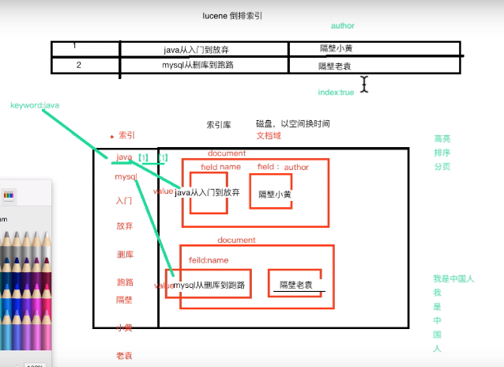
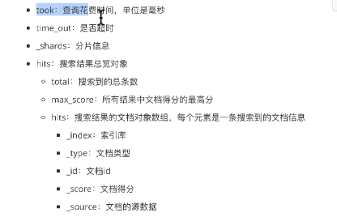

# ES基本语法



## 索引

类似于关系型数据库中的数据库

### 创建索引

```http
PUT /myindex
{
	"settings":{
		"number_of_shards": 3,   //分片数量
		"number_of_replicas": 2  //副本数量
	}
}
```

### 获取索引

```http
GET myindex
```

### 删除索引

```http
DELETE myindex
```

## 映射

索引有了，接下来肯定要添加数据，在添加数据之前必须定义映射，映射是定义文档的过程，文档中包含哪些字段，这些字段是否被保存，是否索引，是否分词等。

### 创建映射

```http
PUT /myindex/_mapping/items     # 索引名/_mapping/映射（数据库表名）
{
  "properties": {
    "indexName":{                 #字段名
      "type": "text",			 #字段类型	
      "index": true,			 #是否索引
      "store": true               #是否存储	
      "analyzer" : "ik_max_word"  分词器
    },
    "indexSize":{
      "type": "integer",
       "index": true,
       "store": true
    }
    
  }  
}
```

### 添加数据

```http
PUT 索引/映射类型/自定义Id
{
	字段：值
	字段：值
	.....
}
```

### 查询数据

```http
GET _search
{
  "query": {
    "match_all": {}
  }
}
```

## 查询

### 结果术语解释

```http
{
  "took" : 0,
  "timed_out" : false,
  "_shards" : {
    "total" : 1,
    "successful" : 1,
    "skipped" : 0,
    "failed" : 0
  },
  "hits" : {
    "total" : {
      "value" : 4,
      "relation" : "eq"
    },
    "max_score" : 1.0,
    "hits" : [
      {
        "_index" : "employee",
        "_type" : "developer",
        "_id" : "1",
        "_score" : 1.0,
        "_source" : {
          "name" : "lga",
          "age" : 22
        }
      },
      {
        "_index" : "employee",
        "_type" : "developer",
        "_id" : "2",
        "_score" : 1.0,
        "_source" : {
          "name" : "lga2",
          "age" : 24
        }
      },
      {
        "_index" : "employee",
        "_type" : "developer",
        "_id" : "3",
        "_score" : 1.0,
        "_source" : {
          "name" : "lga",
          "age" : 90
        }
      },
      {
        "_index" : "employee",
        "_type" : "developer",
        "_id" : "1AIbW2wBiidmwBJFOYbq",
        "_score" : 1.0,
        "_source" : {
          "name" : "zhangsan",
          "age" : 22
        }
      }
    ]
  }
}
```




### 条件查询

**match类型查询，会把查询条件进行分词，然后根据多个词条之间进行or关系的查询**

```http
GET employee/developer/_search
{
  
  "query": {
    "match": {
      "name": "lga"
    }
  }
}
```

**某些情况下，我们需要更加精确的查找，我们希望把这个关系变成and。**

```http
GET employee/developer/_search
{
  "query": {
    "match": {
      "name": {
      	"query":"lga",
      	"operation":"and"
      	}
    }
  }
}
```

查询name中只含有lga的字段

**多字段查询，可以用multi_match**

```http
GET employee/developer/_search
{
  
  "query": {
    "multi_match": {
      "query": "22",
      "fields": ["name","age"]
    }
  }
}
```

查询出字段name，age中带有22的数据

**多词条精确匹配terms**

terms和term查询条件一样，但是它可以进行多值进行匹配。如果这个字段中包含了指定值中的任何一个值，那么这个文档满足条件。

```http
GET employee/developer/_search
{
  "query": {
    "terms": {
      "name": [
        "lga",
        "lga2"
      ]
    }
  }
}
```

精确查询出name为"lga","lga2"的数据

### 结果过滤

_source表示查询后的结果显示的字段。

- includes:来指定想要显示的字段
- exclude:来指定不想要显示的字段

```http
GET employee/developer/_search
{
  
  "query": {
    "terms": {
      "name": [
        "lga",
        "lga2"
      ]
    }
  },
  "_source": "name"
  
}
```

查询的结果只显示name字段的值，若该属性为数组，则[]

```http
GET employee/developer/_search
{
  
  "query": {
    "terms": {
      "name": [
        "lga",
        "lga2"
      ]
    }
  },
  "_source": {
    "includes": ["name","age"]
  }
  
}
```

查询的结果包含name和age属性

### 布尔组合

- must:必须满足
- must_not:不满足
- should:或者的关系
- rang：范围
- fuzzy:模糊匹配

```http
GET employee/developer/_search
{
  
  "query": {
    
    "bool": {
      "must": [
        {
          "match": {
            "name": "lga"
          }
        }
      ],
      "must_not": [
        {
          "match": {
            "age": "22"
          }
        }
      ],
      "should": [
        {
          "match": {
            "name": "wl"
          }
        }
      ]
    }
    
  }
}
```

### 条件过滤

filter加到bool里面

```http
GET employee/developer/_search
{
  
  "query": {
    
    "bool": {
      "must": [
            {
              "match":{
                "name":"lga"
              }
            }
      ],
      "filter": {
        "range": {
          "age": {
            "gte":22
            
          }
        }
      }
      
    }
    
  }
}
```

### 排序

sort排序，和query同级

```http
GET employee/developer/_search
{
  
  "query": {
    
    "bool": {
      "must": [
            {
              "match":{
                "name":"lga"
              }
            }
      ],
      "filter": {
        "range": {
          "age": {
            "gte":22
            
          }
        }
      }
    }
    
  },
  "sort": [
    {
      "age": {
        "order": "asc"
      }
    }
  ]
}
```


