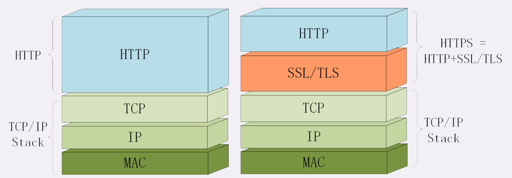
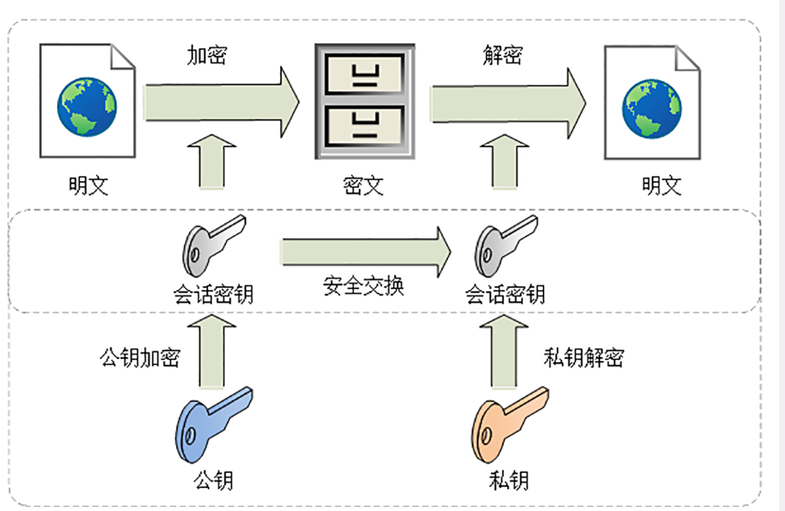
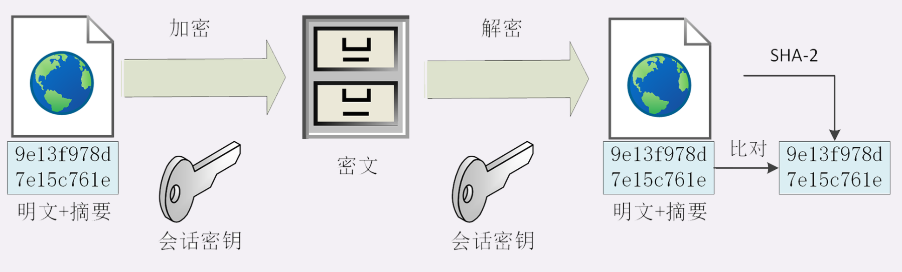
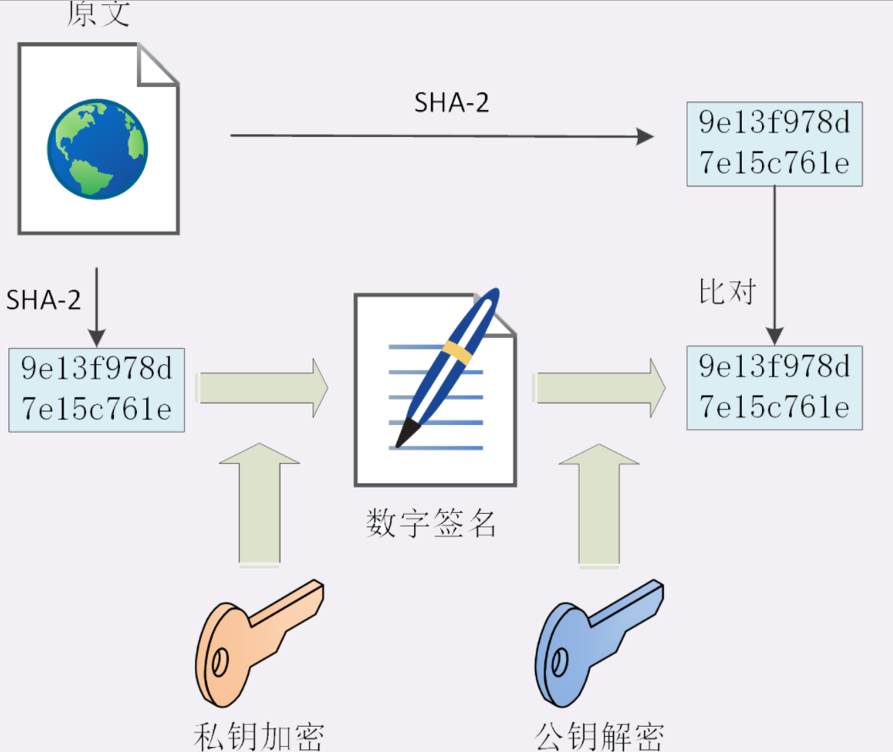

# HTTP 和 HTTPS

> http是不安全的，传输的内容是明文的形式。

## 什么样的通讯是安全的？

- 机密性：数据不能以明文形式传输
- 完整性：传输的过程中不能有人篡改
- 身份认证：确保通行双方都是真实的身份
- 不可否认：也叫不可抵赖，意思是不能否认已经发生过的行为，不能“说话不算数”“耍赖皮”

## HTTPS

### 如何保证机密性

通过非对称加密算法 传输 对称秘钥，秘钥安全传输后再用对称秘钥进行通讯

### 如何保证完整性

虽然接收方收到的数据是密文形式的，但是可以通过篡改密文内容。所以需要保证完整性。

保证完整性的解决方案：摘要算法

所以，真正的完整性必须要建立在机密性之上，在混合加密系统里用会话密钥加密**消息和摘要**，这样黑客无法得知明文，也就没有办法动手脚了。

### 身份认证和不可否认

私钥再加上摘要算法，就能够实现“数字签名”，同时实现“身份认证”和“不可否认”。

