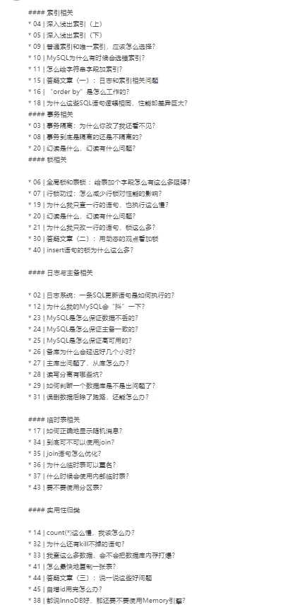
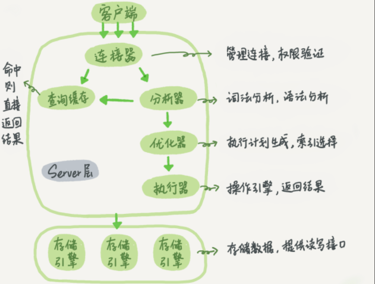
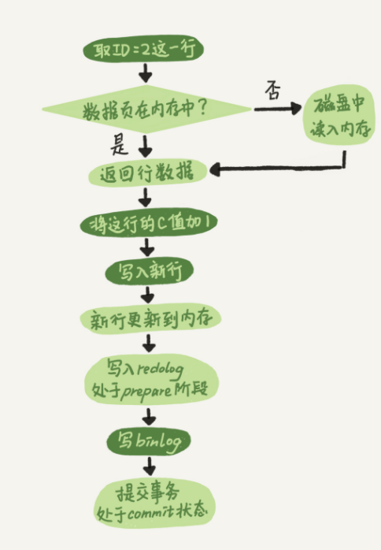

# MYSQL 实战45讲


目的：**构建一张属于自己的Mysql知识网络**

## 




## Mysql 基础架构




## 索引详解

索引是一种数据结构，目的是为了加快查询速度

常见的索引有，**哈希**，**有序数组**，**B+树**

|   类型   |                            缺点                            |                         适用场景                         |
| :------: | :--------------------------------------------------------: | :------------------------------------------------------: |
|   哈希   |                        无法范围查询                        |                 不需要进行范围查询的数据                 |
| 有序数组 | 插入数据的时候需要挪动数据位置，并且需要一段连续的内存空间 |                  静态数据（不新增数据）                  |
|   B+组   |                                                            | 数据库索引，索引存储在磁盘中，B+树可以减少数据页的读次数 |


### 索引常见的优化操作

- 覆盖索引：可以减少回表的次数
- 联合索引：支持最左匹配原则，可以减少维护索引的个数。
- 索引下推：
- 前缀索引：如果使用了前缀索引，覆盖索引就用不上。

### 唯一索引和普通索引的区别

> change buffer概念：为了提高更新操作的执行速度。当内存中已经读入了需要更新的数据页，就是直接更新，如果内存中没有，就将更新操作缓存在chang buffer中，这样就不需要从磁盘中读取数据页了。下次将数据页读入内存的时候，就可以将change buffer和这个数据页的数据进行merge操作，这样就可以保证数据逻辑的正确性。除了访问这个数据页会触发 merge 外，系统有后台线程会定期 merge。在数据库正常关闭（shutdown）的过程中，也会执行 merge 操作。


|              |                           查询过程                           | 更新过程 |
| :----------: | :----------------------------------------------------------: | :------: |
| **普通索引** | 当查询满足条件后，需要继续寻找下一个记录，直到碰到第一个不满足条件的记录就返回（下一个记录可能是在下一页，这个时候效率会低，但是发生的概率很低）。 |          |
| **唯一索引** |         找到第一个满足条件的记录后就会立即停止检索。         |          |


### 优化器索引选错了怎么处理

```sql
# 使用force index() 强制指定索引
explain select * from t force index(a) where (a between 1 and 1000)  and (b between 50000 and 100000) order by b limit 1;
```


### order by 排序查询的全过程

```sql

# 创建表
CREATE TABLE `t` (
  `id` int(11) NOT NULL,
  `city` varchar(16) NOT NULL,
  `name` varchar(16) NOT NULL,
  `age` int(11) NOT NULL,
  `addr` varchar(128) DEFAULT NULL,
  PRIMARY KEY (`id`),
  KEY `city` (`city`)
) ENGINE=InnoDB;

#执行语句
select city,name,age from t where city='杭州' order by name limit 1000  ;
```


## 日志系统

> WAL（Write-Ahead Logging），先写日志，再写磁盘


### redo log(重做日志)

InnoDB存储引擎特有的日志

当更新操作的时候，会先更新redo log，然后再更新内存，这个时候更新操作就算完成了。
同时，InnoDB引擎会在适当的时候，将这个操作记录更新到磁盘中，这个更新往往都是系统比较空闲的时候。
循环写，redo log 保存的东西太多了，此时只能更新到磁盘中了。

redo log保证了crash-safe能力，即使数据库异常重启，之前提交的内容也不会丢失。


### binlog（归档日志）

Server层的日志，不保证crash-safe，任何存储引擎都有。

记录的是逻辑日志。

追加写，文件写到一定大小后会切换到下一个文件。

有两种模式：

**statement** 格式是记录sql语句的。

**row**格式记录行的内容，记录两条，更新前和更新后都有。


### 两阶段提交




## 事务相关


事务是在引擎层面实现的，并不是所有的存储引擎都支持事务。

begin/start transaction 命令并不是一个事务的起点，在执行到它们之后的第一个操作 InnoDB 表的语句，事务才真正启动。如果你想要马上启动一个事务，可以使用 start transaction with consistent snapshot 这个命令。

>第一种启动方式，一致性视图是在执行第一个快照读语句时创建的；
>
>第二种启动方式，一致性视图是在执行 start transaction with consistent snapshot 时创建的。

 

更新数据都是先读后写的，而这个读，只能读当前的值，称为“当前读”（current read）。
除了 update 语句外，select 语句如果加锁，也是当前读。

​                                             

当数据库上有多个事务同时执行的时候，就可能出现脏读（dirty read）、不可重复读（non-repeatable read）、幻读（phantom read）的问题，为了解决这些问题，就有了“隔离级别”的概念。


- 读未提交是指，一个事务还没提交时，它做的变更就能被别的事务看到。
- 读提交是指，一个事务提交之后，它做的变更才会被其他事务看到。
- 可重复读是指，一个事务执行过程中看到的数据，总是跟这个事务在启动时看到的数据是一致的。当然在可重复读隔离级别下，未提交变更对其他事务也是不可见的。
- 串行化，顾名思义是对于同一行记录，“写”会加“写锁”，“读”会加“读锁”。当出现读写锁冲突的时候，后访问的事务必须等前一个事务执行完成，才能继续执行。

如果是可重复读隔离级别，事务 T 启动的时候会创建一个视图 read-view，之后事务 T 执行期间，即使有其他事务修改了数据，事务 T 看到的仍然跟在启动时看到的一样。也就是说，一个在可重复读隔离级别下执行的事务，好像与世无争，不受外界影响。


### 避免长事务

长事务意味着系统里面会存在很老的事务视图。由于这些事务随时可能访问数据库里面的任何数据，所以这个事务提交之前，数据库里面它可能用到的回滚记录都必须保留，这就会导致大量占用存储空间。

除了对回滚段的影响，长事务还占用锁资源，也可能拖垮整个库

解决方案：开启自动提交。set autocommit = 1。

```sql
# 查看隔离级别
show variables like 'transaction_isolation';

# 用于查找持续时间超过 60s 的事务
select * from information_schema.innodb_trx where TIME_TO_SEC(timediff(now(),trx_started))>60;
```


### MVCC

> **MVCC**在**MySQL InnoDB**中的实现主要是为了提高数据库并发性能，用更好的方式去处理读-写冲突，做到即使有读写冲突时，也能做到不加锁，非阻塞并发读
>
> **说白了MVCC就是为了实现读-写冲突不加锁，而这个读指的就是`快照读`, 而非当前读，当前读实际上是一种加锁的操作，是悲观锁的实现**


## 锁

### 全局锁

用于全库逻辑备份

```sql
# 加全局读锁
Flush tables with read lock;
# 解锁
unlock tables;
```


### 表锁

```sql
# 加表锁
lock tables ....   read/write

# 解锁
unlock tables

```

MDL 表锁，不需要显示的使用，当对一个表做增删改查操作的时候，加 MDL 读锁；当要对表做结构变更操作的时候，加 MDL 写锁。


### 行锁

是由引擎层来实现的。


### 死锁检测

出发实际：如果他要加锁访问的行上有锁，他才要检测。\1. 一致性读不会加锁，就不需要做死锁检测；

 并不是每次死锁检测都都要扫所有事务。比如某个时刻，事务等待状态是这样的：

  B在等A，
  D在等C，
  现在来了一个E，发现E需要等D，那么E就判断跟D、C是否会形成死锁，这个检测不用管B和A


## 临时表


