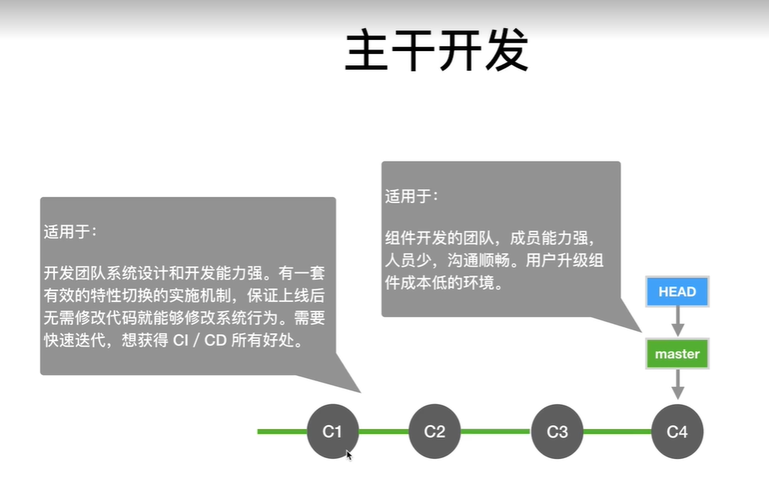
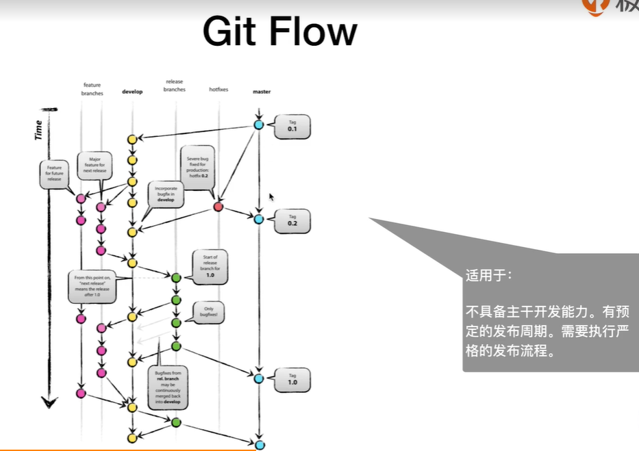
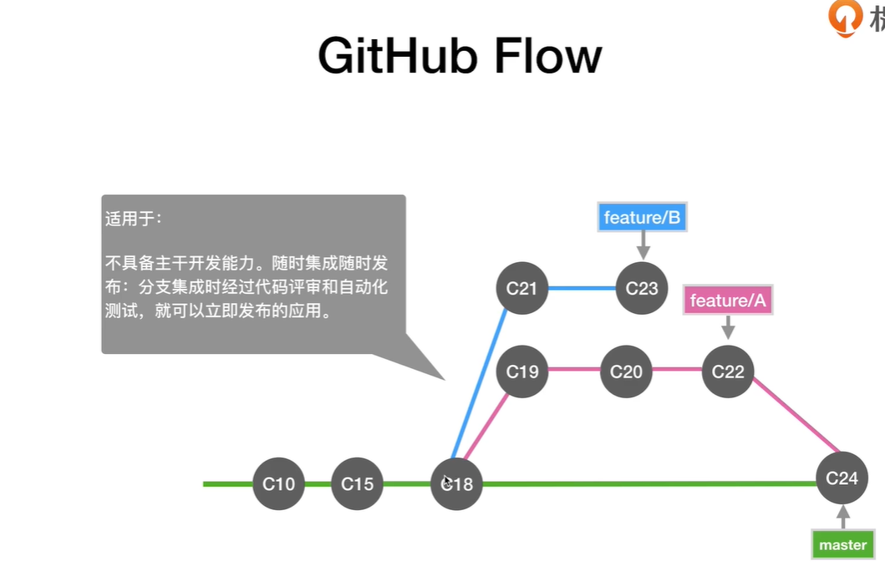

# SVN和GIT


## cmd命令开启svn

svnserve -d -r E:\SVN_WEB\web

### git的执行流程

工作区->暂存区->主库

## git命令

### 配置用户名和邮箱

 git config --global user.name "lgaBug"

git config --global user.email "972514286@qq.com"

### 初始化git

git init

### 添加文件

git add a.txt

### 提交文件

git commit -m "第二次提交2222"（强制要写注释，不然报错）

### 查看状态

git status

### 查不同 

git diff a.txt

### 查看日志

git log（可以查看文件修改的信息）

 git reflog

### 返回上一个版本

git reset --hard HEAD^（一个‘^’代表一个版本）

### 撤销修改

git  checkout --a.txt

### 删除文件/撤销删除

rm a.txt/git checkout --a.txt

创建公钥

ssh-keygen -t rsa -C "972514286@qq.com"

### git连接远程仓库（gitHub）

git remote add origin git@github.com:lgaBug/bjlemon.git 

### 将分支代码传到master分支上

git push -u origin master 

### 传到master分支时出错了（主要原因是在本地代码中没有README.md文件）

先执行

git pull --rebase origin master 

再上传

git push -u origin master 

### 将远程仓库的项目克隆到本地

git clone git@github.com:lgaBug/bjlemon.git

### git和GitHub的联系

GitHub是基于git的一个远程仓库

### SVN和GIT的优缺点比较

1．SVN优缺点
优点： 
1、 管理方便，逻辑明确，符合一般人思维习惯。 
2、 易于管理，集中式服务器更能保证安全性。 
3、 代码一致性非常高。 
4、 适合开发人数不多的项目开发。 
缺点： 
1、 服务器压力太大，数据库容量暴增。 
2、 如果不能连接到服务器上，基本上不可以工作，看上面第二步，如果服务器不能连接上，就不能提交，还原，对比等等。 
3、 不适合开源开发（开发人数非常非常多，但是Google app engine就是用svn的）。但是一般集中式管理的有非常明确的权限管理机制（例如分支访问限制），可以实现分层管理，从而很好的解决开发人数众多的问题。

2．Git优缺点
优点： 
1、适合分布式开发，强调个体。 
2、公共服务器压力和数据量都不会太大。 
3、速度快、灵活。 
4、任意两个开发者之间可以很容易的解决冲突。 
5、离线工作。 
缺点： 
1、学习周期相对而言比较长。 
2、不符合常规思维。 
3、代码保密性差，一旦开发者把整个库克隆下来就可以完全公开所有代码和版本信息。

## 

##  git笔记

### 目的：借助gitHub来托管我们的代码


## GIT命令总汇


```powershell
#查看分支
git branch  -v
#查看所有分支
git branch -a
#查看提交情况
git log --oneline --all
#查看远程仓库
git remote -v
#本地仓库与远程仓库建立连接
git remote add 自定义仓库名称 地址
#fetch远程仓库的内容
git fetch 自定义仓库名称 master
#删除分支
git branch -D 
#修改最新commit的注释
git commit --amend
#修改之前的注释
git rebase -i (parentId)
#多个commit合成一个
git rebase -i 
#比较暂存区和HEAD的文件区别
git diff --cached
#比较工作区和暂存区的文件区别
git diff
#恢复暂存区的文件和HEAD中的文件，让其保持一致
git reset HEAD 
#工作区恢复和暂存区一样的
git checkout 
#恢复至指定的commit
git reset --hard 
#对比不同提交的指定文件的差异
git diff temp master -- 文件名
#删除文件
git rm 文件名
#保存目前的工作区
git stash
#恢复之前保存的工作区
git stash pop


```


## 公私钥配置

```powershell
#生成公私钥
ssh-keygen -t rsa -b 4096 -C "18270234907@163.com"
#在gitHub上配置ssh公钥就可以免密pull/push
```


## 通过GitHub高效搜索

1. 直接通过搜索框搜索的话，是根据**仓库名称**和**描述**来搜的
2. 通过readme.md来搜索， 关键字  **in:readme**
   1. 组合搜索 **start:>1000** **language:java** 
3. 搜文件中带有什么内容， **'  内容 '  filename:文件名**  

## 如果选择适合团队的开发流程

1. 主干开发：
2. Git Flow
3. GitHub Flow
4. GitLab Flow


 