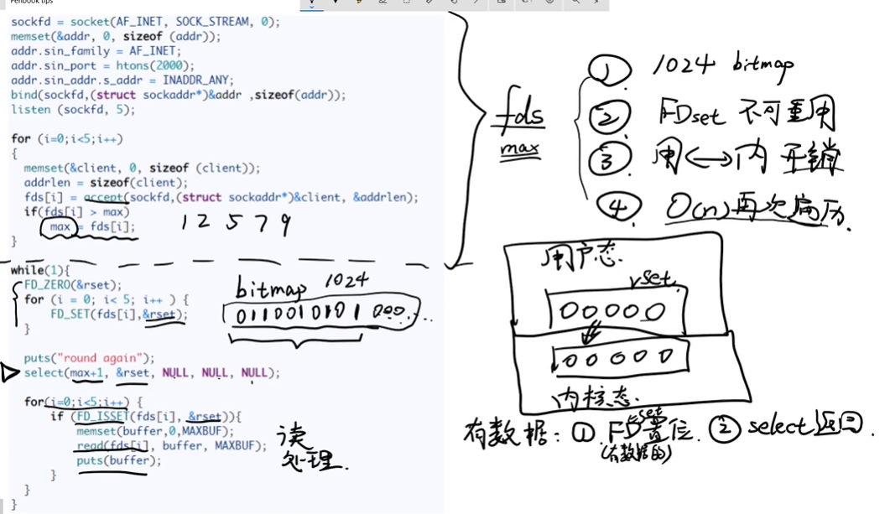
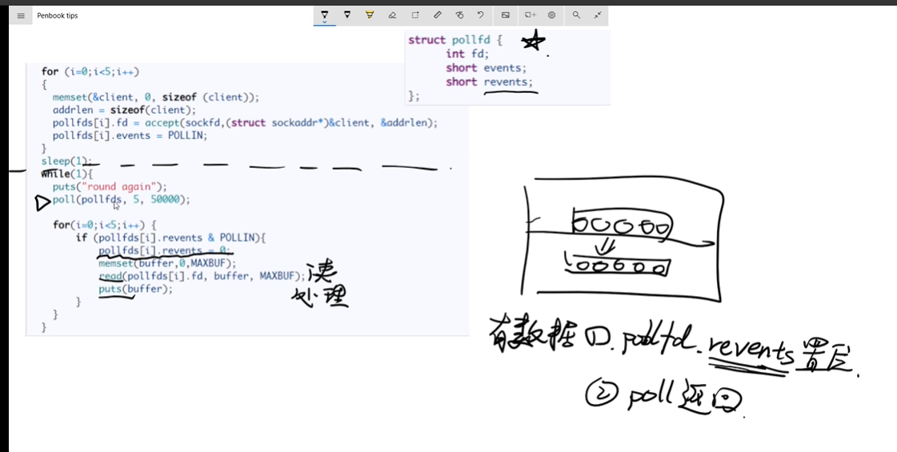
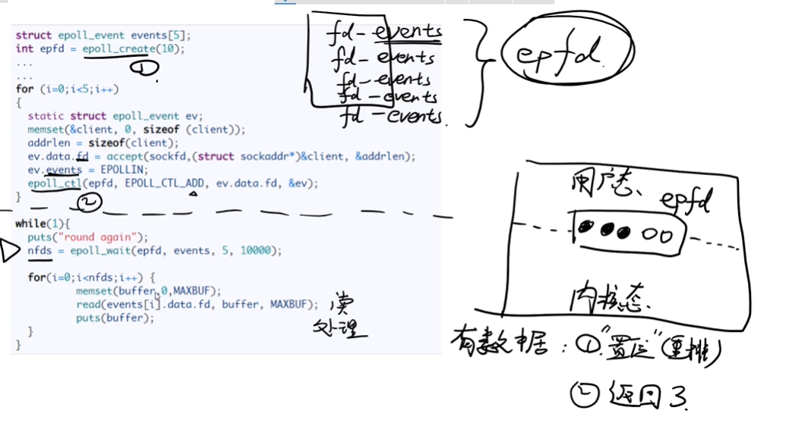

# IO多路复用机制

## 多线程处理方式

对于多个客户端的连接请求，server端创建多个线程来处理。

- 缺点：线程数过多，会进行大量的线程上下文切换，导致消耗大量的资源
- 有点：处理简单，针对客户端请求连接数不多的应用可以采取。

## 单线程处理方式

### select

rset 是一个bitmap数据类型，最多可以存储1024bit

1. 每一次循环检查fd的时候，都需要将fd从用户态传到内核态，由内核态来判断这个fd文件是否有数据到来，当有一个数据或者多个数据的时候并且返回并且置位
2. 遍历rset，判断哪一个rset被置位了。读取相应的数据，然后执行相应的逻辑

- 缺点：bitmap 最多存储1024个bit,并且不能复用，
- 每次循环的时候都要创建一个这样的bitmap，不可重用
- 从用户态切换到内核态，仍然是要一定的开销
- 每次select返回的时候，需要全部遍历，时间复杂度是O(n)

### poll

没有用reset了，改成了pollfd的数组

1. 将pollfds从用户态转移到内核态。
2. 当有数据时，将revent置位，返回
3. 遍历pollfds，并将revent设置位0，这样就可以复用pollfds

- 优点：解决了bitmap 1024的限制 
- 可以重用pollfds

- 缺点：用户态到内核态的切换开销没有解决
- 当poll 返回时，需要遍历整个pollfds的问题没有解决

### epoll

使用了epfd数据结构，epfd中不包含revent字段。

epoll是由三个函数组成，epoll_create、epoll_ctll、epoll_wait

1. epfd放在了用户态和内核态之间，避免了内核态和用户态之间的切换。
2. 当有数据时，会对epfd进行置位，并且重排，放到前面，然后返回有数据的fd数量
3. 遍历有数据的fd，读取数据，执行相应的逻辑

**redis、nginx、javaNio**  在liunx下都用用epoll来实现的

