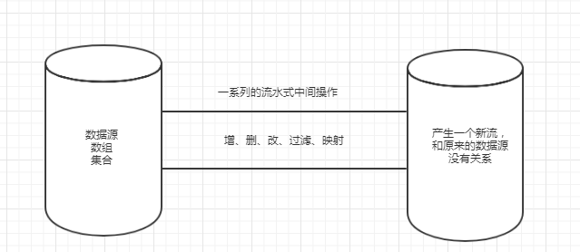

# Java8的新特性总结

## 简介：

- 速度更快（hashMap采用了红黑树）
- 代码更少（增加了Lambda表达式）
- 强大的Stream API
- 便于并行
- 最大化减少空指针Optional

## 一:Lambda表达式

> ```
> Lambda表达式：需要函数式接口的支持（接口中只有一个抽象方法的接口）@FunctionalInterface
> 左侧：表达式中的参数列表,可以不写参数类型
> 右侧：所需要执行的功能，只有一行代码时，可以不用{}，多行代码必须{}
> (x...) -> {}
> ```

```java
 @Test
    public void test2() {
        Comparator<Integer> comparator = (x, y) -> {
            return x.compareTo(y);
        };
    }
```

```java

@FunctionalInterface
public interface MyFunction {

    public Integer getValue(Integer num1);
}

```

```java
public class LambdaTest {

    /**
    *数字处理器
    *@param num:
    *@param mf：处理方式的接口
    */
    public Integer integerHandler(Integer num, MyFunction mf) {
        return mf.getValue(num);
    }

    @Test
    public void test1() {
        Integer num = integerHandler(3, (x) -> x * x);
        System.out.println("num = " + num);
    }
}
```

```java
package com.lga;

/**
 * java8 内置的四大核心函数式接口
 *
 * Consumer<T> 消费型接口
 *      void accept(T t);
 *
 * Supplier<T> 供给型接口
 *      T get();
 *
 * Function(T,R) 函数型接口
 *      R apply(T t);
 *
 *  Predicate<T> 断言型接口
 *       boolean test(T t);
 */

import org.junit.Test;

import java.util.ArrayList;
import java.util.Arrays;
import java.util.List;
import java.util.function.Consumer;
import java.util.function.Function;
import java.util.function.Predicate;
import java.util.function.Supplier;

public class LambdaTest2 {

    //Consumer<T> 消费型接口
    public void happy(double money, Consumer<Double> consumer) {
        consumer.accept(money);
    }

    @Test
    public void test1() {
        happy(1000,(m)-> System.out.println("我上网花了："+m+"元"));
    }


    //需求：产生指定个数的整数，并放入集合中
    //Supplier<T> 供给型接口
    public List<Integer> getNumList(int num, Supplier<Integer> sup) {
        List<Integer> list = new ArrayList<>();
        for (int i = 0; i < num; i++) {
            Integer n = sup.get();
            list.add(n);
        }
        return list;
    }

    @Test
    public void test2() {
        List<Integer> numList = getNumList(10, () -> {
            return (int) (Math.random() * 100);
        });
        for (int num : numList) {
            System.out.println("num = " + num);
        }
    }


    //需求：处理字符串
    //Function(T,R) 函数型接口
    public String strHandler(String str, Function<String,String> fn) {
        return fn.apply(str);
    }

    @Test
    public void test3() {
        String str1 = strHandler("liugaoan", (str) -> str.toUpperCase());
        System.out.println("str1 = " + str1);
    }

    //需求：对集合进行处理筛选
    //Predicate<T> 断言型接口
    public List<Integer> filterNumber(List<Integer> list, Predicate<Integer> pre) {
        List<Integer> resultList = new ArrayList<>();
        for (Integer num : list) {
            if (pre.test(num)) {
                resultList.add(num);
            }
        }
        return resultList;
    }

    //筛选出集合中大于5的数字
    @Test
    public void test4() {
        System.out.println(filterNumber(Arrays.asList(1, 2, 3, 4, 5, 6, 7, 11), (x) -> {
            return x > 5;
        }));
    }

}

```


## 二：函数式接口

> java8 内置的四大核心函数式接口
> Consumer<T> 消费型接口
>      void accept(T t);
>
> Supplier<T> 供给型接口
>      T get();
>
>  Function<T,R> 函数型接口
>       R apply(T t);
>
>  Predicate<T> 断言型接口
>       boolean test(T t);

## 三：方法引用与构造器引用

```java
package com.lga;

import org.junit.Test;

import java.util.Arrays;
import java.util.List;
import java.util.function.Consumer;
import java.util.function.Supplier;

/**
 * 方法引用：若Lambda体中的内容方法已经实现了，我们可以使用“方法引用”。
 *          （可以理解为方法引用是Lambda的另一种表现形式）
 *
 * 主要有三种形式：
 * 对象::实例方法名
 * 类::静态方法名
 * 类::实例方法名
 *
 * 注意：Lambda体中的调用方法的参数列表与返回值类型，要与函数式接口中抽象方法的
 * 参数列表与返回值的类型一致
 */
public class MehodRefTest {

    @Test
    public void test1() {

        List<Integer> integerList = Arrays.asList(1, 2, 3, 4, 5);
        integerList.stream().forEach(
                (x) -> System.out.println(x)
        );

        Consumer<String> consumer = System.out::println;
        consumer.accept("abc");

        Supplier<Double> supplier = Math::random;
        System.out.println(supplier.get());
    }


}

```


## 四：Stream API

> 处理集合的关键抽象概念，可以对集合进行非常复杂的操作，查找、过滤、映射等。
>
> stream不会改变原对象，只会产生一个持有新的的stream结果集

 

> ```
> Stream 的三个操作步骤 
> 1.创建stream  
> 2.中间操作  
> 3.终止操作 
> ```

```java
//创建Stream
    @Test
    public void test1() {
        List<String> list = new ArrayList<>();
        //集合中的获取流
        Stream<String> stream = list.stream();
        //数组中的获取流
        Stream<String> stream1 = Arrays.stream(new String[]{"abc", "def"});
        //通过Stream中的静态方法获取流
        Stream<String> aaa = Stream.of("aaa", "ppp");
        //创建无限流
        //1：迭代
        Stream.iterate(0, (x) -> x + 2).limit(10).forEach(System.out::println);
        //2:生成
        Stream.generate(() -> Math.random()).limit(5).forEach((x)->System.out.println(x));

    }
```

```java
 //中间操作
    List<User> userList = Arrays.asList(
            new User("lga", 22, 99.99d),
            new User("lga1", 32, 55.99d),
            new User("lga2", 42, 66.66d),
            new User("lga3", 52, 77.77d)
    );	

     List<Employee> employeeList = Arrays.asList(
                new Employee("lga", 22, 99.99d, Status.BUSY),
                new Employee("lga1", 32, 55.99d, Status.BUSY),
                new Employee("lga2", 42, 66.66d, Status.FREE),
                new Employee("lga3", 52, 77.77d, Status.VOCATION)
        );

    //中间操作的所有操作都不会执行，只有执行了终止操作才会执行中间操作。
    /**
     * 筛选和切片
     * filter---接收Lambda,从流中排出某些元素
     * limit---截断流，使其元素不超过给定数量
     * skip(n)---跳过元素，返回一个扔掉了前n个元素的流。若流中元素不足一个，则返回一个空流，与limit(n)互补。
     * distinct---筛选，通过流所产生的hashCode()和equals()去除重复的元素。
     *
     */
    @Test
    public void test1() {
        userList.stream()
                .filter((user) -> user.getAge() > 30)
                .forEach(System.out::println);
    }

```

```java
 /**
     * 查找与匹配
     * allMatch----检查是否匹配所有元素
     * anyMatch----检查是否匹配一个元素
     * noneMatch----检查是否没有匹配所有元素
     * findFirst----返回第一个元素
     * findAny----返回当前流中的任意元素
     * count----返回流中元素的总个数
     * max----返回流中的最大值
     * min----返回流中的最小值
     */
    @Test
    public void test1() {
        boolean flag = userList.stream().allMatch((user) -> {
            return user.getName().contains("lga1");
        });
        System.out.println("flag = " + flag);

        boolean flag1 =  userList.stream().anyMatch((user) -> {
            return user.getName().contains("lga1");
        });
        System.out.println("flag1 = " + flag1);

        boolean flag2 =  userList.stream().noneMatch((user) -> {
            return user.getName().contains("lga1");
        });
        System.out.println("flag1 = " + flag1);

        Optional<User> optionalUser = userList.stream().findFirst();
        System.out.println("optionalUser = " + optionalUser);
        optionalUser.get();
    }

```

```java
	/**
     *
     * 归约
     * reduce --- 可以将流中元素反复结合起来，得到一个值
     */
    @Test
    public void test3() {
        List<Integer> list = Arrays.asList(1, 2, 3, 4, 5, 6, 7, 8, 9, 10);
        Integer result = list.stream()
                .reduce(0, (x, y) -> x + y);
        System.out.println("result = " + result);

        //获取工资总和
        Double result1 = userList.stream()
                .map((user) -> user.getSalary())
                .reduce(0.0, (x, y) -> x + y);
        System.out.println("result1 = " + result1);
    }

    /**
     * 收集
     * collect --- 将流转换为其他形式，接收一个Collector接口的实现，用于给Stream
     * 中元素做汇总的方法
     */
    @Test
    public void test4() {
        List<String> list = userList.stream()
                .map(User::getName)
                .collect(Collectors.toList());
        list.forEach(System.out::println);

        System.out.println("-------------------");

        List<User> users = userList.stream()
                .filter((user) -> user.getAge() > 30)
                .collect(Collectors.toList());
        users.forEach(System.out::println);

        //获取最大工资的员工
        //方式一
        Optional<User> userOptional = userList.stream()
                .collect(Collectors.maxBy((user1, user2) -> Double.compare(user1.getSalary(), user2.getSalary())));
        System.out.println("userOptional.get() = " + userOptional.get());

        System.out.println("---------------");
        //方式二
        Optional<User> userOptional1 = userList.stream()
                .max((user1, user2) -> Double.compare(user1.getSalary(), user2.getSalary()));
        System.out.println("userOptional.get() = " + userOptional.get());
    }	
```

```java
	/**
     * 分组
     */
    @Test
    public void test5() {

        //根据状态进行分组
        Map<Status, List<Employee>> map = employeeList.stream()
                .collect(Collectors.groupingBy(Employee::getStatus));

        System.out.println("map = " + map);
    }
```


## 五：接口中的默认方法

## 六：新时间日期API

## 七：其他新特性