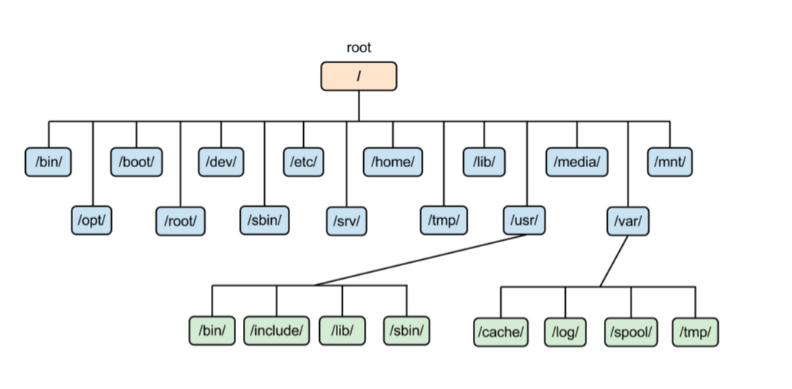
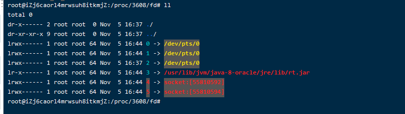
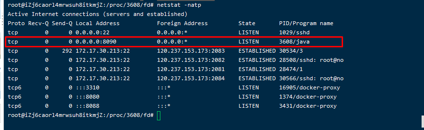
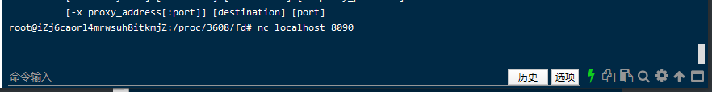
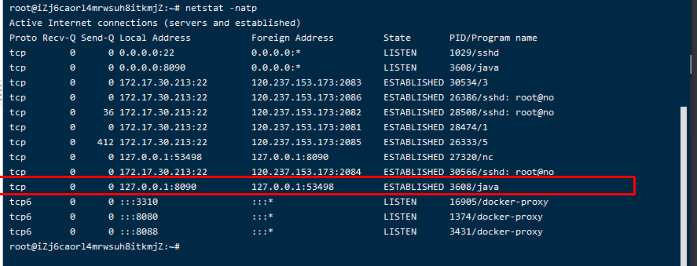
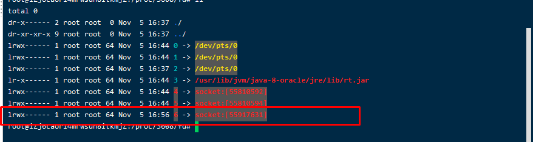

# linux常用命令

## 文件系统结构




## 进程相关

```sh
#批量关闭相关的进程
ps -aux | grep （进程名称）
kill -s 9 (pid）
#查看某个服务是否打开
systemctl status 服务名
```


## 端口相关

```sh
firewall-cmd --list-ports; 	#查看端口号时候被开放
firewall-cmd --zone=public --add-port=3306/tcp --permanent; #将3306端口号开放
firewall-cmd --reload;		#开放端口号之后要重启防火墙

（注意：若输入命令后报错了，可能是防火墙服务禁止了，关闭了，这时输入以下命名来启动linux防火墙：（当服务被关闭时）启动防火墙服务：systemctl ummask firewalld启动墙：systemctl start firewalld）


```

```sql
--赋予远程连接的用户权限 root是用户,passowd是密码
grant all privileges  on *.* to root@'%' identified by "password"; 
-- 刷新权限
flush privileges;

```

```shell
source /etc/profile  #修改完了profile文件需要刷新一下
```

## vim相关

```sh
#查找
/
#查看下一个/上一个
n/N
#打开行号
:set number
#复制当前行
yy
#粘贴
p
#返回
u/U
#定位到首行/最后一行
gg/G
#定位到某一行
100gg
#打开文件的时候直接跳到某一行
vim 文件名 +行号

```

## shell相关

```shell
#程序并发执行
&
wait
#执行脚本的时候锁住
flock


```


## 时间相关

```
#设置时间区域
cd /etc
mv localtime localtime.bak
ln -s /usr/share/zoneinfo/Asia/Shanghai  /etc/localtime

```


## 文件描述符相关

```shell
#抓取程序有没有发生系统调用
strace -ff -o ./   java TestSock

#一切进程都是文件
cd /proc/pid
#task 下的目录是这个进程下有多少个线程
#fd 4，5代表一个ipv4,一个ipv6
#nc 是linux 下的一个小程序，可以和任何人建立tcp连接，发送数据

```



服务端正在监听8090端口号



使用nc 建立tcp连接



多了一个连接



文件描述符中也多了一个连接



控制台打印了连接的客户端的端口号

