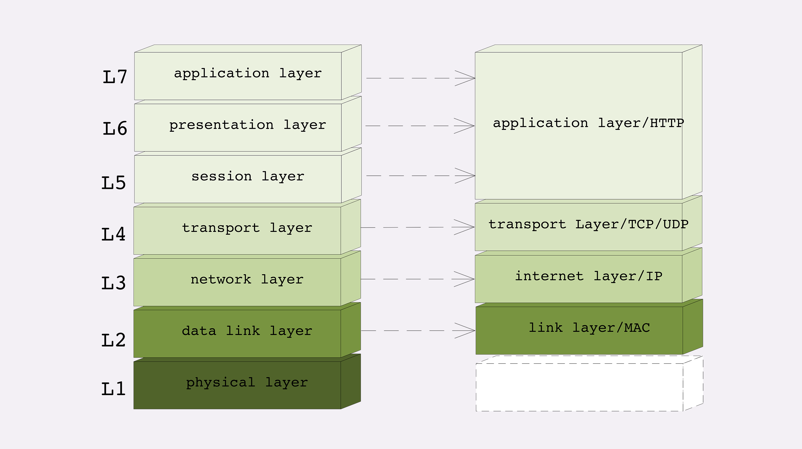
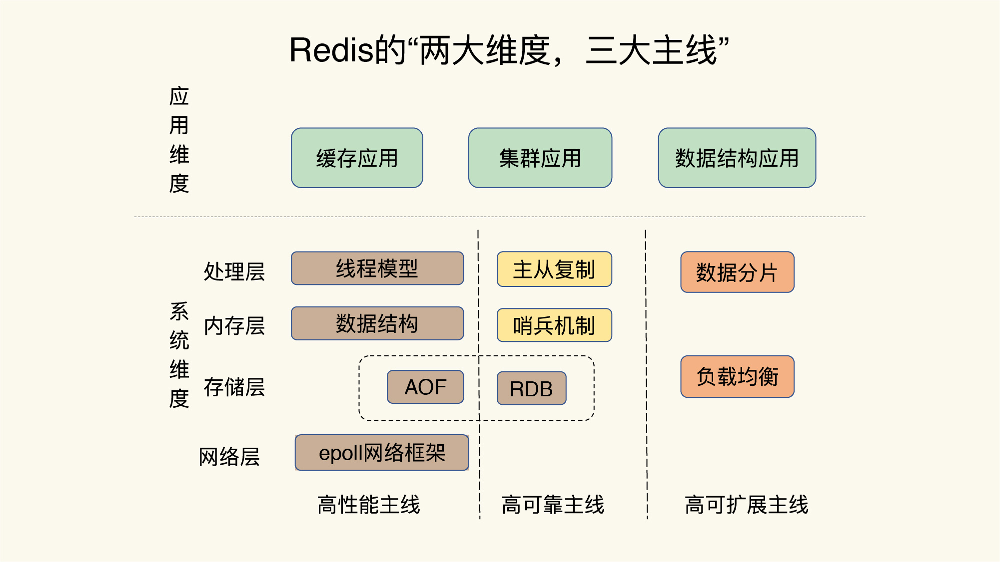
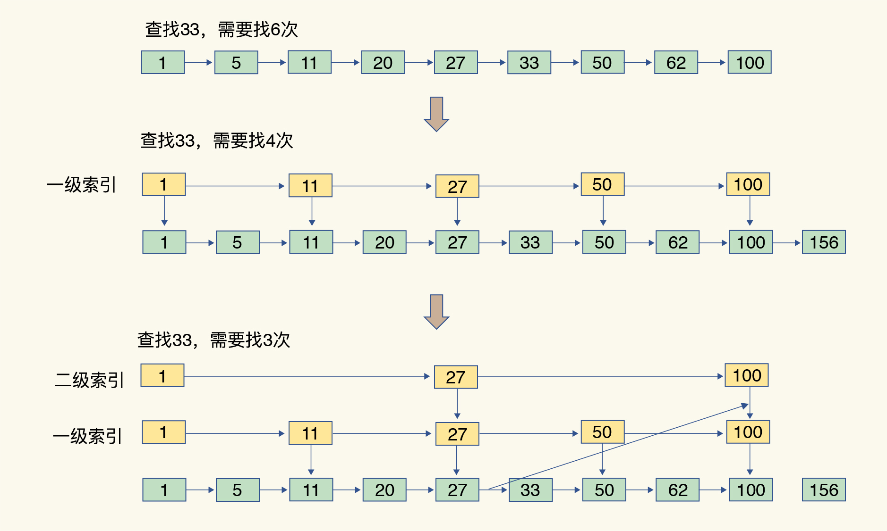
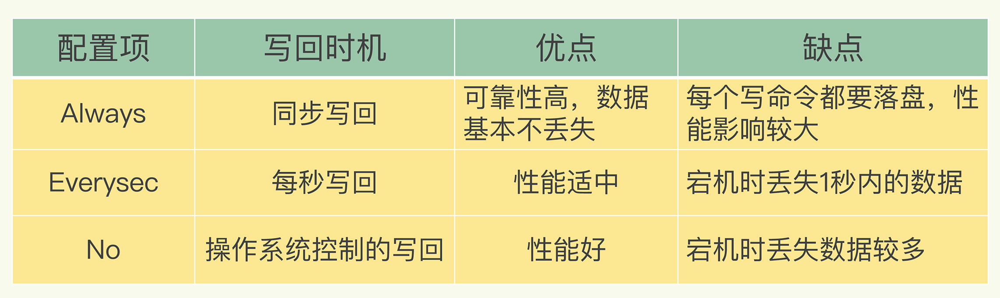
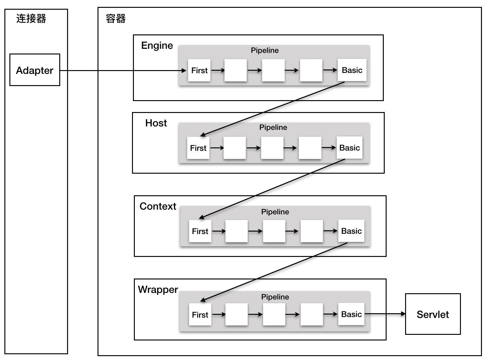

# 计算机网络

## 网络模型

### OSI七层模型 和TCP/IP五层模型




### 二层转发、三层路由

> 二层转发对应OSI模型的数据链路层，就是解决数据本地传输的问题，具体，利用交换机等2层设备mac地址学习和端口的映射，实现数据的本地转发 三层路由对应OSI模型的网络层，解决网际间数据传输的问题，具体通过路由选路，将数据发往指定IP所在的网络。
>
> 


## 五种IO模型

> - 阻塞和非阻塞：在read的时候，是等待内核数据就绪还是直接返回，如果直接返回则为非阻塞，等待数据准备则为阻塞
> - 同步和异步：如果请求放在发送请求到最后完成的这一段过程中都需要自己参与就是同步，请求完了之后返回就是异步。

### 阻塞IO

> ​	一直等待内核数据准备好了，然后返回

### 非阻塞IO

> ​	调用后内核中的数据没有就绪就返回一个错误码，然后轮询，直到有数据

### 多路复用IO

>  	非阻塞io中一个线程监听一个连接，在高并发场景下，需要创建大量的线程，消费系统资源。
>
> ​	 用一个线程去监听多个连接，也就是一个或者多个fd，当fd有数据的时候，select、poll、epool会返回需要进行下一步操作的fd，然后下一步操作交给对应的线程池去处理。

### 信号驱动IO

> ​	多路复用io中的select 通过轮询的方式来监控多个fd，通过轮询判断fd是否可读，轮询的方式比较暴力，比较消费资源。
>
> ​	在发起系统调用的时候向内核注册一个回调函数，数据准备好了之后，会通知应用直接去读取数据

### 异步IO

> 发起系统调用告知内核发起某个操作，当操作完成后告知应用，完成了轮询和拷贝两个动作。
>
> Windows 的 IOCP 和 Linux 内核 2.6 的 AIO 都提供了异步 I/O 的支持，Java 的 NIO.2 API 就是对操作系统异步 I/O API 的封装
>
> Java的NIO.2是通过epoll来模拟实现的

### 零拷贝

> ​	mmap 减少了内核态到用户态的拷贝
>
> ​	sendfile

## HTTP/HTTPS

### 输入url经历的所有过程

1. 浏览器对url进行安全检查，访问限制检查。
2. 浏览器查询缓存，如果存在缓存就直接返回
3. 通过DNS查询ip地址，判断浏览器缓存、操作系统缓存、路由器缓存、ISP缓存，都没有的话DNS服务器就把请求转发到互联网根域


4. 浏览器通过URL封装HTTP请求头，请求体
5. 传输层
6. 网络层
7. 链路层
8. 物理层


### 三次握手

### 四次挥手

### HTTPS证书交换过程


# 操作系统

## 进程的通讯方式

1. **管道/匿名管道(Pipes)** ：用于具有亲缘关系的父子进程间或者兄弟进程之间的通信。
2. **有名管道(Names Pipes)** : 匿名管道由于没有名字，只能用于亲缘关系的进程间通信。为了克服这个缺点，提出了有名管道。有名管道严格遵循**先进先出(first in first out)**。有名管道以磁盘文件的方式存在，可以实现本机任意两个进程通信。
3. **信号(Signal)** ：信号是一种比较复杂的通信方式，用于通知接收进程某个事件已经发生；
4. **消息队列(Message Queuing)** ：消息队列是消息的链表,具有特定的格式,存放在内存中并由消息队列标识符标识。管道和消息队列的通信数据都是先进先出的原则。与管道（无名管道：只存在于内存中的文件；命名管道：存在于实际的磁盘介质或者文件系统）不同的是消息队列存放在内核中，只有在内核重启(即，操作系统重启)或者显示地删除一个消息队列时，该消息队列才会被真正的删除。消息队列可以实现消息的随机查询,消息不一定要以先进先出的次序读取,也可以按消息的类型读取.比 FIFO 更有优势。**消息队列克服了信号承载信息量少，管道只能承载无格式字 节流以及缓冲区大小受限等缺。**
5. **信号量(Semaphores)** ：信号量是一个计数器，用于多进程对共享数据的访问，信号量的意图在于进程间同步。这种通信方式主要用于解决与同步相关的问题并避免竞争条件。
6. **共享内存(Shared memory)** ：使得多个进程可以访问同一块内存空间，不同进程可以及时看到对方进程中对共享内存中数据的更新。这种方式需要依靠某种同步操作，如互斥锁和信号量等。可以说这是最有用的进程间通信方式。
7. **套接字(Sockets)** : 此方法主要用于在客户端和服务器之间通过网络进行通信。套接字是支持 TCP/IP 的网络通信的基本操作单元，可以看做是不同主机之间的进程进行双向通信的端点，简单的说就是通信的两方的一种约定，用套接字中的相关函数来完成通信过程。

## 进程的调度算法

为了确定首先执行哪个进程以及最后执行哪个进程以实现最大 CPU 利用率，计算机科学家已经定义了一些算法，它们是：

- **先到先服务(FCFS)调度算法** : 从就绪队列中选择一个最先进入该队列的进程为之分配资源，使它立即执行并一直执行到完成或发生某事件而被阻塞放弃占用 CPU 时再重新调度。
- **短作业优先(SJF)的调度算法** : 从就绪队列中选出一个估计运行时间最短的进程为之分配资源，使它立即执行并一直执行到完成或发生某事件而被阻塞放弃占用 CPU 时再重新调度。
- **时间片轮转调度算法** : 时间片轮转调度是一种最古老，最简单，最公平且使用最广的算法，又称 RR(Round robin)调度。每个进程被分配一个时间段，称作它的时间片，即该进程允许运行的时间。
- **多级反馈队列调度算法** ：前面介绍的几种进程调度的算法都有一定的局限性。如**短进程优先的调度算法，仅照顾了短进程而忽略了长进程** 。多级反馈队列调度算法既能使高优先级的作业得到响应又能使短作业（进程）迅速完成。，因而它是目前**被公认的一种较好的进程调度算法**，UNIX 操作系统采取的便是这种调度算法。
- **优先级调度** ： 为每个流程分配优先级，首先执行具有最高优先级的进程，依此类推。具有相同优先级的进程以 FCFS 方式执行。可以根据内存要求，时间要求或任何其他资源要求来确定优先级。

## 虚拟内存


# SpringCloud常用组件

# 分布式

### 架构的设计目的

> 架构设计的主要目的是为了解决软件系统复杂度带来的问题。

**架构的复杂度体现在哪些方面**

> 性能、可用性、扩展性、硬件成本、人力成本、安全性、规模

### 高性能

#### 读写分离

> **存在的问题**：
>
> - 主从复制延迟:
>   - 写操作后的读操作指定发给数据库主服务器
>   - 读从机失败后再读一次主机
>   - 关键业务读写操作全部指向主机，非关键业务采用读写分离
> - 分配机制
>   - 程序代码封装选择读取哪个库，缺点是无法通用到其他系统
>   - 开源框架可以实现TDDL,其基本原理是一个基于集中式配置的 jdbc datasource 实现，具有主备、读写分离、动态数据库配置等功能
>   - 
>   - 中间件封装（实现难度较高）
>
> 如果存了数据之后立马要读，其实可以去缓存中读取，不一定要去从库读取。
>
> 例如注册后登录这种业务，可以在注册后加入数据库，并加入缓存，登录的时候先查缓存再查库表。

#### 分库分表

> **垂直拆分**：
>
> 将常用的字段和不常用的字段拆开。但是后续的查询要查两次
>
> **水平拆分存在的问题**：
>
> - 路由
>   - 范围路由：缺点是分配不均，优点是方便扩容
>   - Hash路由：优点是分配均匀，缺点是不方便扩容
> - count()时需要把所有表查一次累加起来

#### NoSQL

> **关系型数据库的缺点**：
>
> - 关系数据库存储的是行记录，无法存储数据结构
> - 扩展不方便，DDL时需要锁表
> - 在大数据场景下 I/O 较高
> - 关系数据库的全文搜索功能比较弱
>
> NoSQL牺牲了ACID中的某个或者某些特征，应该将NoSQL作为SQL的一种补充，并非银弹
>
> **常见NoSQL:**
>
> 1. K-V 存储：解决关系数据库无法存储数据结构的问题，以 Redis 为代表。
> 2. 文档数据库：解决关系数据库强 schema 约束的问题，以 MongoDB 为代表。
> 3. 列式数据库：解决关系数据库大数据场景下的 I/O 问题，以 HBase 为代表。
> 4. 全文搜索引擎：解决关系数据库的全文搜索性能问题，以 Elasticsearch 为代表。

#### 缓存

> **缓存带来的问题**：
>
> - 缓存穿透：由于黑客利用不存在的Key直接大量查询，大致直接查询DB
>
>   - 查询存储系统的数据没有找到，则直接设置一个默认值
>
> - 缓存雪崩：指大量缓存失效，大部分线程都去请求DB然后更新缓存（缓存只要有一个线程去更新就可以了）
>
>   - 更新锁：对缓存更新操作进行加锁保护，保证只有一个线程能够进行缓存更新，未能获取更新锁的线程要么等待锁释放后重新读取缓存，要么就返回空值或者默认值。
>   - 后台更新：
>
> - 缓存热点:虽然缓存系统本身的性能比较高，但对于一些特别热点的数据，如果大部分甚至所有的业务请求都命中同一份缓存数据，则这份数据所在的缓存服务器的压力也很大。例如，某明星微博发布“我们”来宣告恋爱了，短时间内上千万的用户都会来围观。
>
>   - 缓存热点的解决方案就是复制多份缓存副本，将请求分散到多个缓存服务器上，减轻缓存热点导致的单台缓存服务器压力。
>
>   

#### 分布式事务

##### 2PC

> - #### PreCommit
>
> - #### doCommit
>
> 

##### 3PC

> - #### CanCommit
>
> - **PreCommit**
>
> - **doCommit**
>
> 

#### Reacotr模型

#### 负载均衡

> **分类:**	
>
> - DNS 负载均衡
> - 硬件负载均衡
> - 软件负载均衡
>
> **算法:**
>
> - 轮询
> - 加权轮询
> - Hash 类
> - ID Hash


### 高可用

#### CAP

> 关注的粒度是数据，而不是整个系统。
>
> 在 CAP 理论落地实践时，我们需要将系统内的数据按照不同的应用场景和要求进行分类，每类数据选择不同的策略（CP 还是 AP），而不是直接限定整个系统所有数据都是同一策略。
>
> 1. 一致性（Consistency）
> 2. 可用性（Availability）
> 3. 分区容忍性（Partition Tolerance）

#### 集群

#### 异地多活

**降级、熔断、限流**

### 高可扩

#### 分层架构

> 1. B/S、C/S
> 2. MVC

#### SOA架构

> 一般用于一个企业内的系统架构，ESB服务总线，用于连接各个系统之间的调用

#### 微服务架构

> 微服务时对SOA的一种实现
>
> 微服务就是使用 HTTP RESTful 协议来实现 ESB 的 SOA
>
> **存在的问题**：
>
> 微服务拆分过细，过分强调“small”。
>
> 微服务基础设施不健全，忽略了“automated”。
>
> 微服务并不轻量级，规模大了后，“lightweight”不再适应。
>
> 

#### 微内核架构


# 常考算法

## 滑动窗口

```java
	/**
     * 76. 最小覆盖子串
     * @param s
     * @param t
     * @return
     */
    public String minWindow(String s, String t) {
        Map<Character, Integer> need = new HashMap();
        Map<Character, Integer> windows = new HashMap();

        for (char c : t.toCharArray()) {
            need.put(c, need.getOrDefault(c, 0) + 1);
        }

        int left = 0;
        int right = 0;
        int valid = 0;
        int start = 0;
        int len = Integer.MAX_VALUE;

        while (right < s.length()) {
            char c = s.charAt(right++);
            // 把元素添加到窗口
            if (need.containsKey(c)) {
                windows.put(c, windows.getOrDefault(c, 0) + 1);
                if (need.get(c).equals(windows.get(c))) {
                    valid++;
                }
            }

            //判断是否需要收缩
            while (valid == need.size()) {
                //更新最小字串
                if (right - left < len) {
                    start = left;
                    len = right - left;
                }

                char b = s.charAt(left++);
                if (need.containsKey(b)) {
                    if (need.get(b).equals(windows.get(b))) {
                        valid--;
                    }
                    windows.put(b, windows.get(b) - 1);

                }
            }

        }

        return len == Integer.MAX_VALUE ? "" : s.substring(start, len + start);
    }
```

```java
    /**
     * 567. 字符串的排列
     * @param s1
     * @param s2
     * @return
     */
    public boolean checkInclusion(String s1, String s2) {

        Map<Character,Integer> need = new HashMap();
        Map<Character,Integer> window = new HashMap();

        //将t中的字符放到need中
        for (char c: s1.toCharArray()) need.put(c,need.getOrDefault(c,0)+1);

        int left = 0;
        int right = 0;
        int valid = 0;

        while (right < s2.length()){
            Character c = s2.charAt(right);
            right++;

            if(need.containsKey(c)){
                window.put(c,window.getOrDefault(c,0)+1);
                if(need.get(c).equals(window.get(c))) valid++;
            }

            while (right-left >=s1.length() ){
                if(valid == need.size()) return true;

                Character b = s2.charAt(left);
                left++;
                if(need.containsKey(b)){
                    if(need.get(b).equals(window.get(b))) valid--;
                    window.put(b,window.get(b)-1);
                }
            }

        }

        return false;
    }
```

```java	
	/**
     * 438. 找到字符串中所有字母异位词
     * @param s
     * @param p
     * @return
     */
    public List<Integer> findAnagrams(String s, String p) {

        Map<Character, Integer> need = new HashMap();
        Map<Character, Integer> windows = new HashMap();

        for (char c : p.toCharArray()) {
            need.put(c, need.getOrDefault(c, 0) + 1);
        }

        List<Integer> res = new LinkedList();

        int left = 0;
        int right = 0;
        int valid = 0;

        while (right < s.length()) {

            //指针右移
            char c = s.charAt(right++);

            if (need.containsKey(c)) {
                windows.put(c, windows.getOrDefault(c, 0) + 1);
                if (need.get(c).equals(windows.get(c))) valid++;
            }

            //窗口缩小
            while (right - left >= p.length()) {

                if (valid == need.size()) {
                    res.add(left);
                }

                char d = s.charAt(left++);

                if (need.containsKey(d)) {
                    if (need.get(d).equals(windows.get(d))) valid--;
                    windows.put(d, windows.get(d) - 1);
                }
            }

        }

        return res;
    }
```


```java
	/**
     * 3. 无重复字符的最长子串
     * @param s
     * @return
     */
    public int lengthOfLongestSubstring(String s) {
        Map<Character,Integer> windows = new HashMap();

        int left = 0;
        int right = 0;
        int res = 0;

        while(right < s.length()) {

            char c = s.charAt(right++);
            windows.put(c,windows.getOrDefault(c,0) + 1);

            while(windows.get(c) > 1) {
                char d = s.charAt(left++);
                windows.put(d,windows.getOrDefault(d,0) - 1);
            }

            res = Math.max(res,right - left);
        }
        return res;
    }	
```


# JVM

### JVM内存模型


### 垃圾收集算法

> - 复制算法：主要用于年轻代，因为大部分对象都会在这里被回收，简单高效。需要复制拷贝以及损耗一般的内存
> - 标记清除：主要用于老年代，垃圾较少，但是存在内存碎片。
> - 标记整理：解决标记清除中的垃圾碎片

### 常见垃圾回收器


### 如何正确选择垃圾回收器

> - Serial GC:CPU核数小，小型的客户端应用
> - Parallel Scavenge GC:吞吐量优先，但是延迟比较高
> - CMS:低延迟，吞吐量不高，GC线程和用户线程可以并发执行
> - G1：在大内存的应用上可以发挥其优势，8G左右的应用

### CMS和G1

> **CMS**:第一次实现了让GC线程和用户线程同时工作，低停顿
>
> **垃圾回收过程：**
>
> 1. 初始标记:所有的工作线程都会STW,仅仅标记GC Roots能直接关联到的对象，这里的执行速度很快
> 2. 并发标记:从GC Root直接关联的对象开始遍历整个对象图，耗时比较长，但是不需要停顿
> 3. 重新标记:修正并发标记阶段期间，因用户线程导致标记变动的一些标记记录，会停顿，停顿时间也不会很长
> 4. 并发清除:删除标记的的对象，释放内存空间，也不需要停顿
>
> **缺点：**
>
> 1. 当“Concurrent Mode Failure”失败时，会临时启动Serial Old收集器来收集，停顿时间会更长
> 2. 会有内存碎片，如果是分配大对象，会提前触发Full GC

> **G1**:G1的出现主要是替代CMS收集器，是JDK9中的默认收集器，可以在延迟可控的情况下尽可能获取最高的吞吐量，每次回收都以尽可能多的回收垃圾未原则来回收
>
> 在后台维护一个优先列表，每次根据允许的收集时间，优先回收价值最大的Region
>
> 
>
> 将整个堆划分为2048个大小相同的Region,新生代和老年代不再是物理隔离的
>
> **G1收集器常见操作步骤**：G1的设计原则，简化JVM调优，开发人员一般只需要三步就可以完成调优
>
> 1. 开启G1收集器
> 2. 设置最大堆内存
> 3. 设置最大停顿时间
>
> **执行过程**：
>
> **缺点**：
>
> 
>
> 
>
> 

# Mysql

### 执行过程


> **连接器**
> Mysql 和连接器建立连接的过程比较复杂的，建议使用长连接，如果空闲的长连接比较多久容易导致OOM，Mysql重启。
>
> 可以定期断开长连接

> **查询缓存**
>
> 查询缓存的失效非常频繁，只要有对一个表的更新，这个表上所有的查询缓存都会被清空。
>
> 建议将查询缓存关闭，在Mysql8.0之后查询缓存功能的模块直接删除了

> **分析器**
>
> 分析sql语法是否正确

> **优化器**
>
> 优化器是在表里面有多个索引的时候，决定使用哪个索引；或者在一个语句有多表关联（join）的时候，决定各个表的连接顺序

> **执行器**
>
> 调用存储引擎提供的接口存储和访问数据，然后做处理返回给请求端


### 日志系统

#### redo log

> **引擎**层物理日志
>
> 用于保证Crash-safe能力
>
> 

#### binlog

> **Server层**逻辑日志
>
> 有两种模式：
>
> - statment：记录sql语句
> - row:记两条，更新前后的两条sql


#### 两阶段提交

> 两阶段提交是跨系统维持数据逻辑一致性时常用的一个方案


### 事务


#### ACID

> 原子性：要么都成功，要么都失败
>
> 一致性：在事务开始之前和事务结束以后，数据库的完整性没有被破坏
>
> 隔离性：数据库允许多个并发事务同时对其数据进行读写和修改的能力，隔离性可以防止多个事务并发执行时由于交叉执行而导致数据的不一致。事务隔离分为不同级别，包括读未提交（Read uncommitted）、读提交（read committed）、可重复读（repeatable read）和串行化（Serializable）
>
> 永久性：事务处理结束后，对数据的修改就是永久的

#### 隔离性

> 隔离级别越高，效率越低，需要找到一个平衡点
>
> Mysql:可重复读
>
> Oracle:提交读
>
> **串行化读**：最高的隔离级别，会加读写锁，后访问的事务必须等待前一个事务结束，效率很低。

| 问题场景   | 导致的原因/隔离级别                                    | 解决方案 |
| ---------- | ------------------------------------------------------ | -------- |
| 脏读       | 读未提交（一个事务还没有提交，另一个事务就看到了修改） | 读提交   |
| 不可重复度 | 读提交（一个事务提交之后，另一个事务就立马可以看到）   | 可重复读 |
| 幻读       | 可重复读（一个事务的执行过程中看到的数据是一致的）     | 串行化读 |


### 索引

#### 常见索引

> - 哈希表：查询快，但是范围查询需要全表扫描
> - 有序数组：查询快，并且支持范围查询，但是更新数据的时候效率比较低。
> - 搜索树：


#### 优化策略

> 1. 覆盖索引
> 2. 最左前缀索引
> 3. 索引下推


### 锁


# Redis

> 每秒10W级别的处理能力




### Redis为什么这么快

> - 基于内存
>
> - 所有的KV都存储在一个全局的Hash表中
>
>   
>
> - 高效的数据结构
>
>   
>
> - 单线程的，避免了线程切换（Redis的网络IO和键值对读写是由一个线程来完成的，这也是Redis对外提供服务的主要流程）,Redis的其他操作，比如持久化、异步删除、集群数据同步等都是由额外的线程来执行的
>
> - IO模型采用了IO多路复用机制

### Redis中有哪些慢操作

> - 数据量大的时候，hash冲突和rehash（渐进式hash）带来的操作阻塞
> - 范围查询操作（HGETALL、SMEMBERS、LRANGE、ZRANGE）,可以使用SCAN命令
> - 大量的数据过期，因为过期机制也是在主线程中执行的。
> - 淘汰策略，也是在主线程中执行的。
> - AOF开启了always机制，每次写入都要刷盘
> - 主从全量同步生成了RDB，fork的时候，会阻塞整个线程

#### rehash过程

> 默认有两个全局哈希表，一开始只使用哈希表1，此时哈希表2还没有分配空间，当要rehash时，需要执行一下操作
>
> 1. 给hash表2分配当前hash表1两倍的内存空间
> 2. 把hash表1的数据重新映射到hash表2中
>    1. 采用的渐进式hash,并不是一次性全部映射
>    2. 处理一个请求时，从哈希表 1 中的第一个索引位置开始，顺带着将这个索引位置上的所有 entries 拷贝到哈希表 2 中
> 3. 释放hash表1的内存


### 数据结构

#### 复杂度


#### 压缩列表

> 压缩列表实际上类似于一个数组，数组中的每一个元素都对应保存一个数据。和数组不同的是，压缩列表在表头有三个字段 zlbytes、zltail 和 zllen，分别表示列表长度、列表尾的偏移量和列表中的 entry 个数；压缩列表在表尾还有一个 zlend，表示列表结束。	
>
> 


#### 跳表

> 有序链表只能逐一查找元素，导致操作起来非常缓慢，于是就出现了跳表。具体来说，跳表在链表的基础上，增加了多级索引，通过索引位置的几个跳转，实现数据的快速定位.
>
> 


### AOF

#### 三种写回策略

> 1. Always
> 2. Everysec
> 3. No
>
> 

#### 重写机制

> 发生宕机时，AOF里面的命令需要被重新执行，用于故障恢复，如果日志文件太大，执行的非常缓慢，所以需要日志文件需要被重写
>
> AOF重写只由后台的子线程bgrewritedof来完成的，这也是为了避免主线程阻塞
>
> Fork一瞬间是会阻塞的

# ElasticSearch

> 分布式可扩展的一个实时搜索和分析引擎，建立在Lucene基础之上的搜索引擎

### 关系型数据库和ES概念对比

| ES           | MYSQL  |
| ------------ | ------ |
| Index        | 数据库 |
| Type         | 数据表 |
| document     | 行     |
| Mapping      | Schema |
| 全文都是索引 | 索引   |


### 倒排索引

> **正向索引：**通过key找vlaue
>
> **反向索引:** 通过vaue找key(倒排索引)


# RabbitMq

### 原理图


### 三种交换器模式

> 1. direct(发布订阅)：有Routing-key
> 2. fanout(广播)：发送给绑定当前绑定Exchange所有的队列
> 3. topic(主题):可以做匹配分发到不同的队列中去，比direct更加灵活


### 消息丢失

> ​		
>
> 
>
> 

### 顺序性消费

> - 消费者必须只有一个
> - 指定自增id


### 重复消费

> 可以通过唯一id约束/数据库id 通过幂等来解决


### 大量消息在MQ中堆积了很久怎么办

> **场景:**
>
> 消费者出问题了，导致大量消息堆积，即使消费者恢复了，处理堆积消息也要1个多小时，这肯定是不行的
>
> **解决方案：**
>
> 1. 先修复consumer的问题，确保能正常消费mq


### **消息设置了过期时间，过期就丢了怎么办**

> 这种情况下，实际上没有什么消息挤压，而是丢了大量的消息。所以第一种增加consumer肯定不适用。
>
> 这种情况可以采取 “批量重导” 的方案来进行解决。
>
> 在流量低峰期(比如夜深人静时)，写一个程序，手动去查询丢失的那部分数据，然后将消息重新发送到mq里面，把丢失的数据重新补回来。


### **积压消息长时间没有处理，mq放不下了怎么办**

> 这个就没有办法了，肯定是第一方案执行太慢，这种时候只好采用 “丢弃+批量重导” 的方式来解决了。
>
> 首先，临时写个程序，连接到mq里面消费数据，收到消息之后直接将其丢弃，快速消费掉积压的消息，降低MQ的压力，然后走第二种方案，在晚上夜深人静时去手动查询重导丢失的这部分数据


# 源码分析

## Tomcat

> HTTP服务器+Servlet容器
>
> - 合理划分功能模块
> - 基于组件化设计
> - 合理的运用了设计模式，使代码结构清晰整洁，提高了扩展性

### 执行流程

> ​	通过端口找到唯一的->service->Engine->通过域名确定Host->通过URL找到Context组件->Wrapper


### Servlet规范

> ​	

### 整体架构


### io多路复用模型


### 相关的设计模式

****

##### **抽象模板方法**


连接器中提供了HTTP/1.1 , HTTP/2, AJP 

IO模型有NIO,AIO,APR

##### 责任链模式

- 过滤器 FilterChain

- Pipeline的Valve

  > ​	整个调用过程由连接器中的 Adapter 触发的，它会调用 Engine 的第一个 Valve：

  ```java
  // Calling the container
  connector.getService().getContainer().getPipeline().getFirst().invoke(request, response);
  ```

  



```java

public interface Pipeline extends Contained {
  public void addValve(Valve valve);
  public Valve getBasic();
  public void setBasic(Valve valve);
  public Valve getFirst();
}
```

> 只要在Adapter中触发调用Engine中的第一个Valve,后面的所有Valve都会被调用。
>
> Wrapper中的最后一个Valve会创建一个Filter链，并调用doFilter方法，最终会调用Servlet的service方法。
>
> ```java	
> // Calling the container
> connector.getService().getContainer().getPipeline().getFirst().invoke(request, response);
> ```

##### 适配器模式

> Adapter一层使用的是适配器设计模式，好处是当容器版本升级只修改Adaper组件适配到新版本容器就可以了，protocal handler组件代码不需要改动
>
> 将 tomcatRequest ->ServletRequest ，将tomcatResponse -> ServletResponse

##### 组合模式

> 容器之间的关系是通过组合模式来管理的
>
> 所有的容器都实现了Container接口
>
> ```java
> public interface Container extends Lifecycle {
>     public void setName(String name);
>     public Container getParent();
>     public void setParent(Container container);
>     public void addChild(Container child);
>     public void removeChild(Container child);
>     public Container findChild(String name);
> }
> ```

##### 监听器模式

> 实现了一键启停	
>
> ContainerBase 调用 start方法的时候 会调用LifeCycleBase中的setState，再调用setStateInternal，再调用fireLifeCycleEvent

## Mybatis

## Spring

### 对Spring的理解

> Spring是一个轻量级、易集成、易测试、扩展性高的一个开源框架，是整个Spring生态的基石，在Spring基础上建立了大量优秀的框架，比如SpringMVC、SpringBoot、SpringCloud、SpringDataJpa等等

### Spring启动的过程

> 解析-》加载-》实例化-》初始化-》使用-》销毁


### Spring如何解决循环依赖

> 缓存+提前引用来解决的
>
> 三级缓存
>
> **创建Bean的过程**：getSingleton获取bean的时候先去 单例池获取，如果没有则再待用getSingleton（beanName，singletonFactory）去创建并添加


### SpringAOP如何实现的

> AOP是对OOP的一种补充，将业务逻辑和非业务逻辑分开，比如异常处理、日志记录、事务处理
>
> 等等。
>
> 实现原理就是动态代理
>
> 1. 目标对象实现了接口则是JDK动态代理
> 2. 没实现则为CGLIB动态代理
>
> **调用过程**：
>
> CGLIB动态代理里面-》intercept()-》1：有拦截器链则封装拦截器链，没有则执行方法-》2：依次执行拦截器链

### Spring常用的设计模式

#### 简单工厂

> **BeanFacotry** 有 getBean(beanName)方法 
>
> 如果需要修改获取对象的逻辑，需要修改工厂内部逻辑，不符合开闭原则

#### 工厂方法

> FactoryBean 
>
> 工厂方法使一个类的实例化延迟到了子类
>
> 使用了开闭原则，

#### 单例模式

> Spring中的bean默认是单例的，全局唯一，并提供了一个全局访问点BeanFactory.getBean()

#### 适配器模式

> AOP中的Advisor链需要MethodIntercepotr对象，所以每一个Advisor中的Advice都要适配成对应的MethodInterceptor对象。使用了适配器AdvisorAdpter
>
> ```java
> public interface AdvisorAdapter {  
>    
> boolean supportsAdvice(Advice advice);  
>    
>       MethodInterceptor getInterceptor(Advisor advisor);  
>    
> }  
> 
> class MethodBeforeAdviceAdapter implements AdvisorAdapter, Serializable {  
>    
>       public boolean supportsAdvice(Advice advice) {  
>             return (advice instanceof MethodBeforeAdvice);  
>       }  
>    
>       public MethodInterceptor getInterceptor(Advisor advisor) {  
>             MethodBeforeAdvice advice = (MethodBeforeAdvice) advisor.getAdvice();  
>       return new MethodBeforeAdviceInterceptor(advice);  
>       }  
> }  
> ```
>
> 

#### 代理模式

> JDK动态代理
>
> CGLIB动态代理

#### 模板方法模式

> **接口**：定义规范
>
> **抽象**：怎么做，给出一个大致模板
>
> **子类**：具体怎么做
>
> 


## JUC

## AQS

https://javadoop.com/


### 可重入锁

> 重入锁的目的是为了解决死锁的问题
>
> 下面程序没有阻塞

```java
public class ReentrantDemo {

    private Lock lock = new ReentrantLock();

    public void demo() {
        //获取锁
        lock.lock();
        System.out.println("begin demo");
        //执行demo2方法
        demo2();
        lock.unlock();
    }

    public void demo2() {
        //获取锁
        lock.lock();
        System.out.println("begin demo2");
        //释放锁
        lock.unlock();
    }

    public static void main(String[] args) {
        ReentrantDemo rd = new ReentrantDemo();
        //启动线程调用demo方法
        new Thread(rd::demo).start();
    }
}

```


## Collection/HashMap

### HashMap

> - capacity 即容量，默认16。
> - loadFactor 加载因子，默认是0.75
> - threshold 阈值。阈值=容量*加载因子。默认12。当元素数量超过阈值时便会触发扩容。

#### 扩容机制


| 比较         | 1.7                      | 1.8                         |
| ------------ | ------------------------ | --------------------------- |
| 数据结构     | 数组+链表                | 数组+链表+红黑树            |
| 节点         | Entry                    | Node TreeNode               |
| Hash算法     | 较为复杂                 | 异或hash右移16位            |
| 对Null的处理 | 单独putForNull()方法处理 | 以hash为0的普通节点处理     |
| 初始化       | table复制给一个空数组    | 没有复制，put的时候才实例化 |
| 扩容         | 插入前扩容               | 插入后扩容                  |
| 节点插入     | 头插法                   | 尾插法                      |


#### 链表转红黑树的条件

> 链表长度大于8 且 桶的长度大于等于64


# 重构/代码优化技巧

### 封装、继承、多态

### 设计原则

> **SOLID：**
>
> - SRP 单一职责原则
> - OCP 开闭原则
>   - 因为修改代码会带来风险，所以对修改关闭可以保持原有代码的稳定性，并且原有的稳定单元中测试也不用修改
> - LSP 里氏替换原则
>   - 子类必须实现父类的抽象方法，但不得重写（覆盖）父类的非抽象（已实现）方法。
>   - 子类中可以增加自己特有的方法。
>   - 当子类覆盖或实现父类的方法时，方法的前置条件（即方法的形参）要比父类方法的输入参数更宽松。
>   - 当子类的方法实现父类的抽象方法时，方法的后置条件（即方法的返回值）要比父类更严格。
> - ISP 接口隔离原则
> - DIP 依赖倒置原则
>   - **高层模块不应该依赖低层模块，二者都应该依赖其抽象。**
>
> DRY、KISS、YAGNI、LOD


### 设计模式

#### 创建型

> **单例模式**
>
> **工厂模式**
>
> **构造者模式**
>
> 原型模式	

#### 结构型

> **代理模式**
>
> **适配器模式**
>
> **装饰器模式**
>
> **桥接模式**
>
> 门面模式
>
> 组合模式
>
> 享元模式

#### 行为型

> **观察者模式**
>
> **模板模式**
>
> **策略模式**
>
> **职责链模式**
>
> **迭代器模式**
>
> 状态模式
>
> 访问者模式
>
> 备忘录模式
>
> 命令模式
>
> 解释器模式
>
> 中介模式

### 编程规范

### 哪些代码可以优化

### 单元测试


# 工作中遇到的难点

### 全局唯一ID重复了

