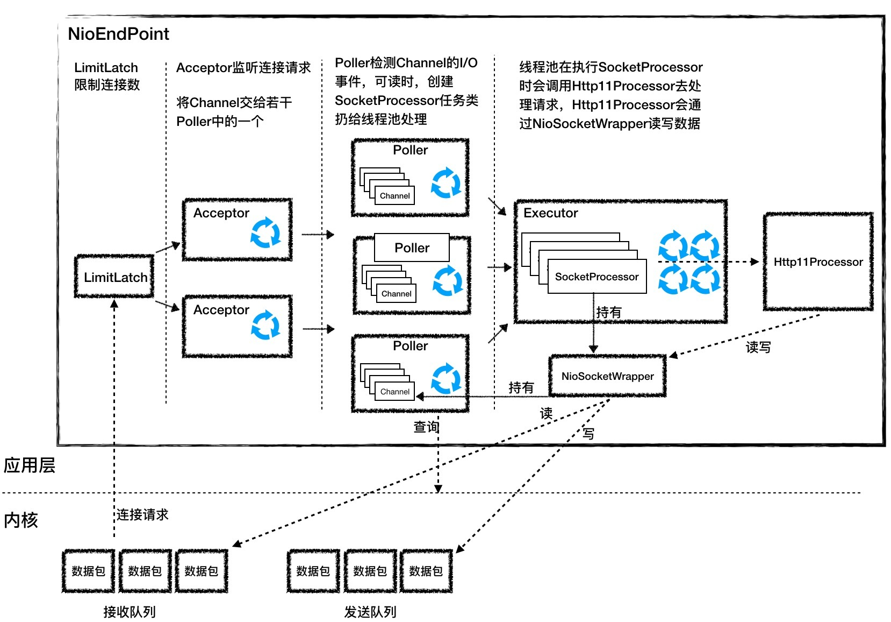

# 计算机网络

## 网络模型

### OSI七层模型

### TCP/IP五层模型


## 五种IO模型

### AIO

> Windows 的 IOCP 和 Linux 内核 2.6 的 AIO 都提供了异步 I/O 的支持，Java 的 NIO.2 API 就是对操作系统异步 I/O API 的封装
>
> Java的NIO.2是通过epoll来模拟实现的

## 内核态和用户态

## 零拷贝

## HTTP/HTTPS

### 输入url经历的所有过程

### 三次握手

### 四次挥手

### HTTPS证书交换过程


# 操作系统

## 线程和进程

### 进程如何通讯

### 线程如何通讯

## 虚拟内存


# 微服务


# 常考算法

## 滑动窗口

```java
	/**
     * 76. 最小覆盖子串
     * @param s
     * @param t
     * @return
     */
    public String minWindow(String s, String t) {
        Map<Character, Integer> need = new HashMap();
        Map<Character, Integer> windows = new HashMap();

        for (char c : t.toCharArray()) {
            need.put(c, need.getOrDefault(c, 0) + 1);
        }

        int left = 0;
        int right = 0;
        int valid = 0;
        int start = 0;
        int len = Integer.MAX_VALUE;

        while (right < s.length()) {
            char c = s.charAt(right++);
            // 把元素添加到窗口
            if (need.containsKey(c)) {
                windows.put(c, windows.getOrDefault(c, 0) + 1);
                if (need.get(c).equals(windows.get(c))) {
                    valid++;
                }
            }

            //判断是否需要收缩
            while (valid == need.size()) {
                //更新最小字串
                if (right - left < len) {
                    start = left;
                    len = right - left;
                }

                char b = s.charAt(left++);
                if (need.containsKey(b)) {
                    if (need.get(b).equals(windows.get(b))) {
                        valid--;
                    }
                    windows.put(b, windows.get(b) - 1);

                }
            }

        }

        return len == Integer.MAX_VALUE ? "" : s.substring(start, len + start);
    }
```

```java
    /**
     * 567. 字符串的排列
     * @param s1
     * @param s2
     * @return
     */
    public boolean checkInclusion(String s1, String s2) {

        Map<Character,Integer> need = new HashMap();
        Map<Character,Integer> window = new HashMap();

        //将t中的字符放到need中
        for (char c: s1.toCharArray()) need.put(c,need.getOrDefault(c,0)+1);

        int left = 0;
        int right = 0;
        int valid = 0;

        while (right < s2.length()){
            Character c = s2.charAt(right);
            right++;

            if(need.containsKey(c)){
                window.put(c,window.getOrDefault(c,0)+1);
                if(need.get(c).equals(window.get(c))) valid++;
            }

            while (right-left >=s1.length() ){
                if(valid == need.size()) return true;

                Character b = s2.charAt(left);
                left++;
                if(need.containsKey(b)){
                    if(need.get(b).equals(window.get(b))) valid--;
                    window.put(b,window.get(b)-1);
                }
            }

        }

        return false;
    }
```

```java	
	/**
     * 438. 找到字符串中所有字母异位词
     * @param s
     * @param p
     * @return
     */
    public List<Integer> findAnagrams(String s, String p) {

        Map<Character, Integer> need = new HashMap();
        Map<Character, Integer> windows = new HashMap();

        for (char c : p.toCharArray()) {
            need.put(c, need.getOrDefault(c, 0) + 1);
        }

        List<Integer> res = new LinkedList();

        int left = 0;
        int right = 0;
        int valid = 0;

        while (right < s.length()) {

            //指针右移
            char c = s.charAt(right++);

            if (need.containsKey(c)) {
                windows.put(c, windows.getOrDefault(c, 0) + 1);
                if (need.get(c).equals(windows.get(c))) valid++;
            }

            //窗口缩小
            while (right - left >= p.length()) {

                if (valid == need.size()) {
                    res.add(left);
                }

                char d = s.charAt(left++);

                if (need.containsKey(d)) {
                    if (need.get(d).equals(windows.get(d))) valid--;
                    windows.put(d, windows.get(d) - 1);
                }
            }

        }

        return res;
    }
```


```java
	/**
     * 3. 无重复字符的最长子串
     * @param s
     * @return
     */
    public int lengthOfLongestSubstring(String s) {
        Map<Character,Integer> windows = new HashMap();

        int left = 0;
        int right = 0;
        int res = 0;

        while(right < s.length()) {

            char c = s.charAt(right++);
            windows.put(c,windows.getOrDefault(c,0) + 1);

            while(windows.get(c) > 1) {
                char d = s.charAt(left++);
                windows.put(d,windows.getOrDefault(d,0) - 1);
            }

            res = Math.max(res,right - left);
        }
        return res;
    }	
```


# JVM

# Mysql

# Redis

# RabbitMq

# 源码分析

## Tomcat

> HTTP服务器+Servlet容器
>
> - 合理划分功能模块
> - 基于组件化设计
> - 合理的运用了设计模式，使代码结构清晰整洁，提高了扩展性

#### 整体架构


#### io多路复用模型



#### 相关的设计模式

****

##### **抽象模板方法**


连接器中提供了HTTP/1.1 , HTTP/2, AJP 

IO模型有NIO,AIO,APR

##### 责任链模式

- 过滤器 FilterChain

- Pipeline的Valve

  > ​	整个调用过程由连接器中的 Adapter 触发的，它会调用 Engine 的第一个 Valve：

  ```java
  // Calling the container
  connector.getService().getContainer().getPipeline().getFirst().invoke(request, response);
  ```

  


## Mybatis

## Spring

> spring是个框架，spring具有良好的稳定性和扩展性，为整个spring生态基石。在spring之上建立了大量的优秀框架，springMVC、springBoot、SpringDataJPA
>
> 加载 -> 解析 -> 创建实例 -> 使用 -> 销毁


## JUC

## AQS

## collection


# 重构/代码优化技巧

# 工作中遇到的难点

