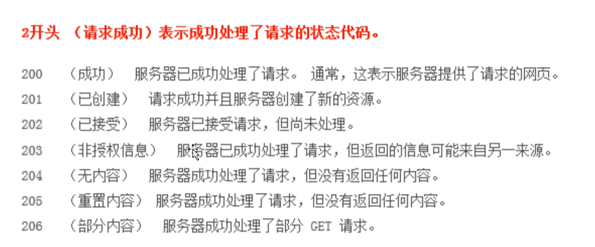
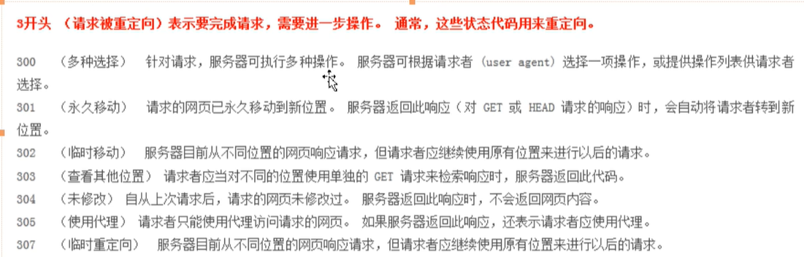
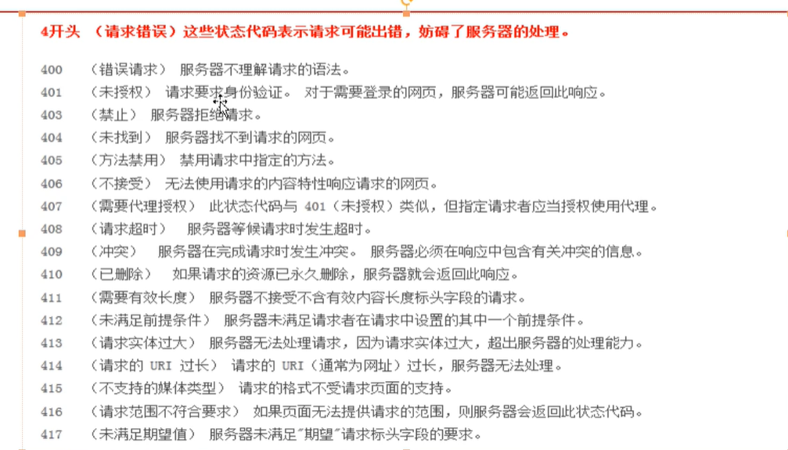
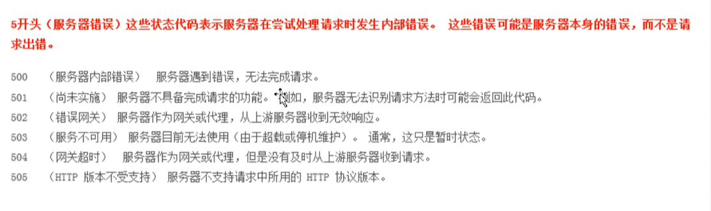

 

# Jmeter 

## 简介

> 用来对软件做压力测试、最初是用作web应用的压测，后来扩展到其他领域，比如静态、动态的资源、数据库、FTP服务器等等

## 与LoadRunner区别

- jmeter更加的轻量级
- jmeter是用java语言写的，需要安装java环境，LoadRunner不需要安装java环境
- LoadRunner的图标系统更加强大，jmeter这一块稍弱
- Jmeter开源免费，LoadRunner收费，并且Jmeter入门很简单

## HTTP请求

- 什么是http
- http特征
- 常用的响应状态码
  - 
  - 
  - 
  - 

## Jmeter界面介绍

## 发送一个Get的Http请求

## 发送一个Post请求

## Http默认值

## 断言

## 聚合报告分析

