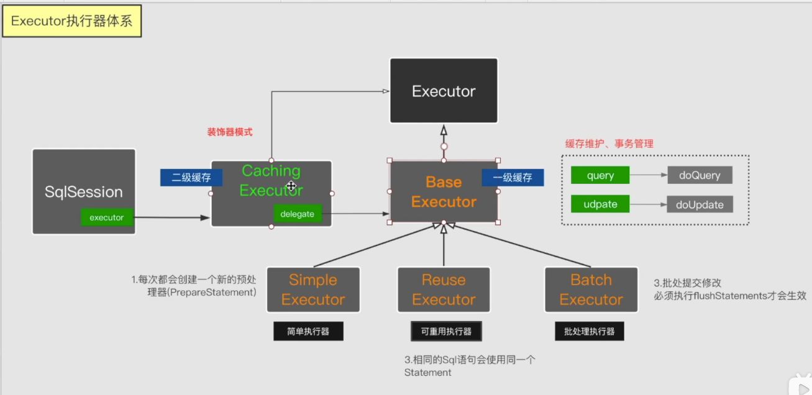
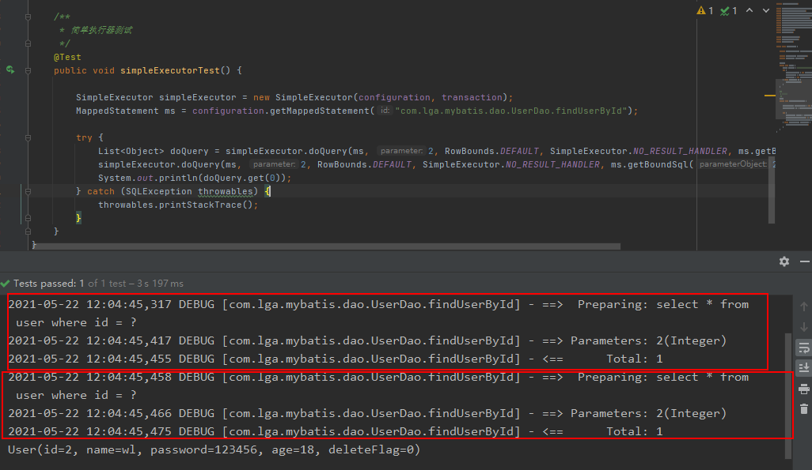
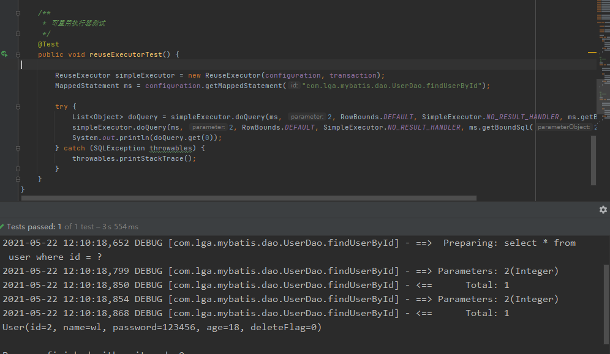
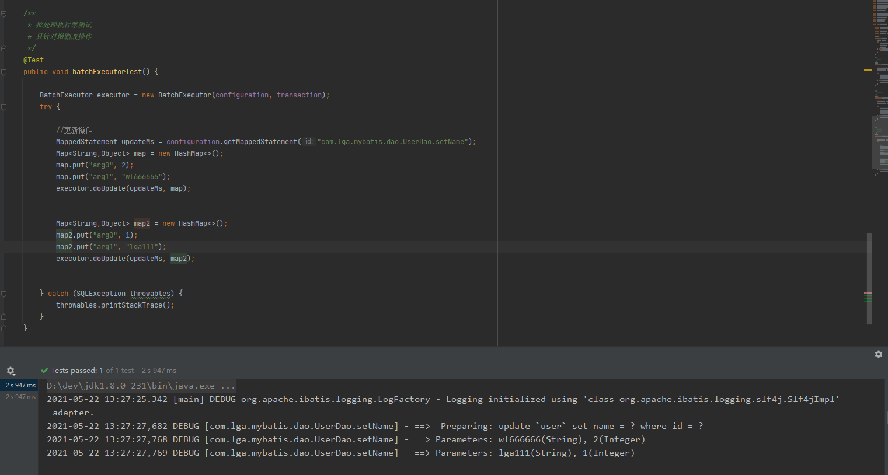
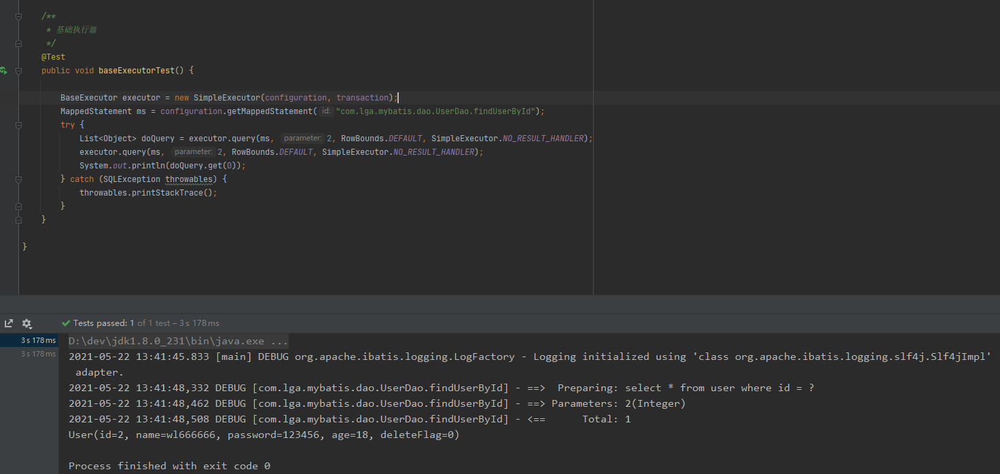
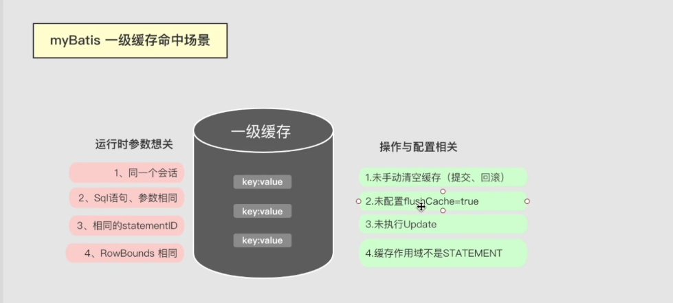
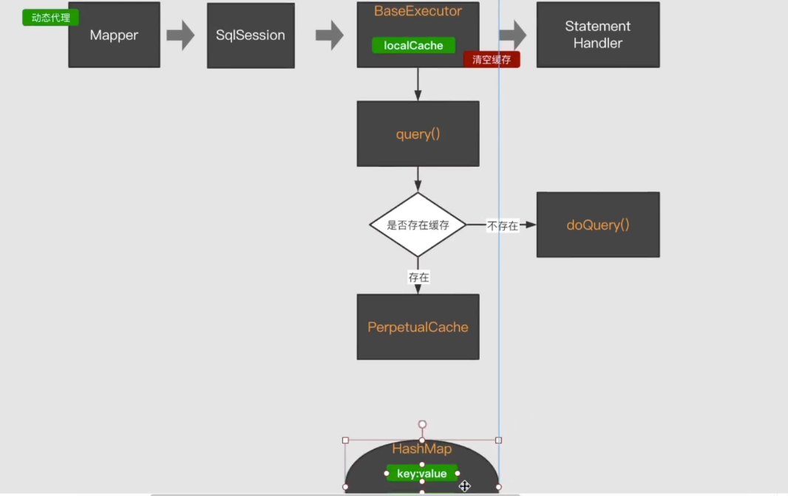
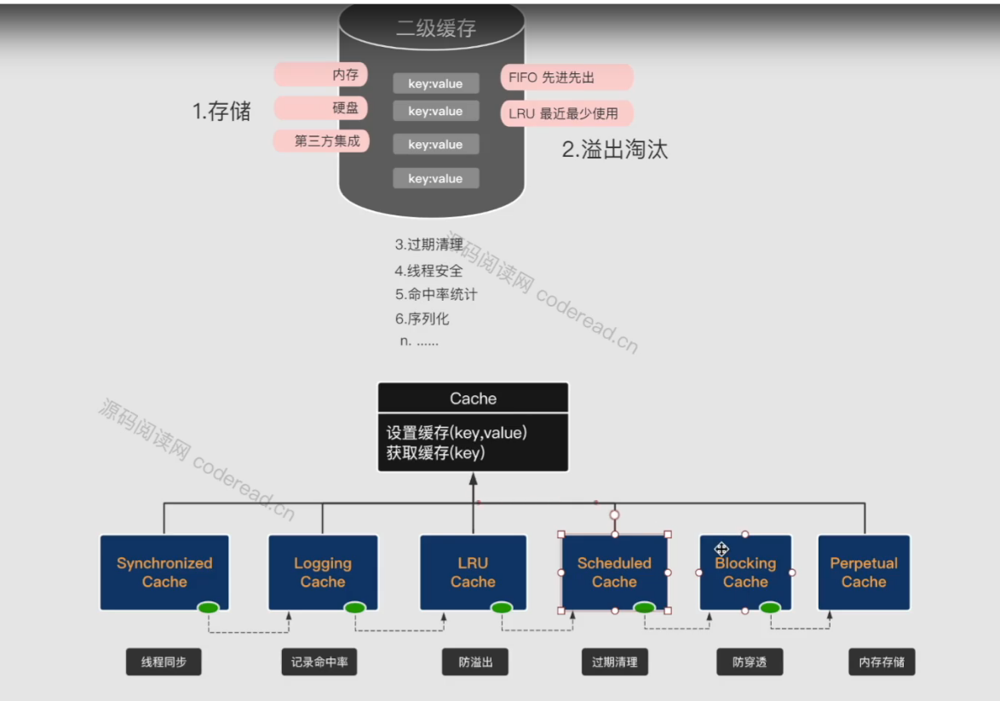
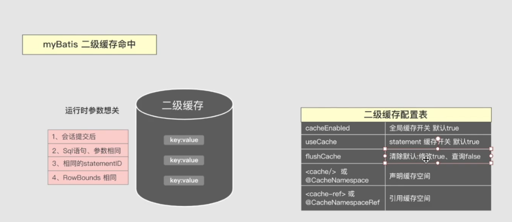
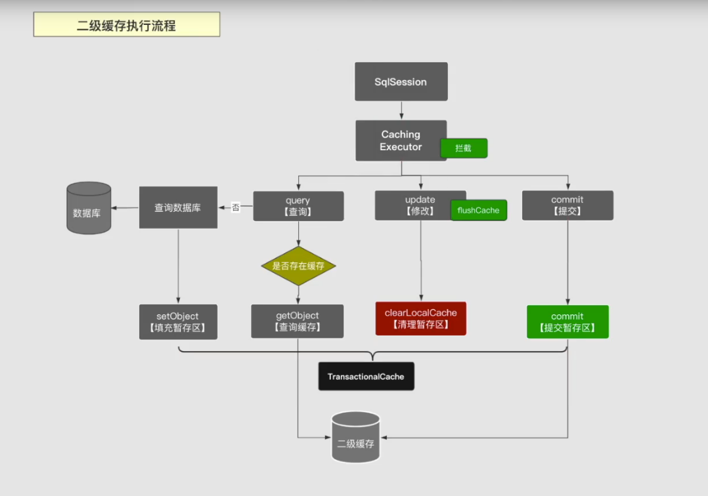

#Mybatis源码学习笔记

## Mybatis执行过程

## Executor

### SimpleExecutor
>无论SQL是否一样，每次都会进行预编译操作

### RecuseExecutor
>当SQL语句一样的时候，只会执行一次预编译处理
> 

### BatchExecutor   ·   ·
>当增删改的时候用该执行器，当sql一样时，只会执行一次预编译处理
> 

### BaseExecutor
>一级缓存缓存实现的地方，范围是当前线程

### CacheExecutor
>二级缓存实现的地方，范围是可以跨线程的，所以要先提交，其他的线程才能使用到二级缓存
> 
>查询的时候先走二级缓存，再走一级缓存的。如果二级缓存有数据，就不走一级缓存了
> 

## 一级缓存
>一级缓存默认是打开的
> 

### 命中场景条件

### 一级缓存执行流程

### 面试可能遇到的问题
- spring 继承mybatis 一级缓存失效
> spring中的myabtis每次执行的时候，都会创建一个新的会话。
> 
> 如何处理：方到同一个事物里
### 使用场景

## 二级缓存

### 缓存结构

### 缓存命中条件

### 二级缓存执行流程

